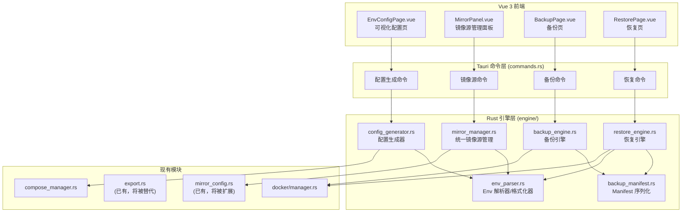

# 设计文档：环境可视化配置与备份恢复

## 概述

本设计为 php-stack（Tauri v2 应用）新增三大核心模块：**可视化 .env 配置生成**、**统一镜像源管理**、**备份与恢复**。设计遵循现有架构模式（Rust 后端 + Vue 3 前端 + Tauri 命令桥接），参考 dnmp 项目的 `.env` → `docker-compose.yml` 配置驱动最佳实践。

### 设计决策与理由

1. **复用现有模块**：`mirror_config.rs` 和 `environment_builder.rs` 已实现部分镜像源和环境构建逻辑，新模块在此基础上扩展，避免重复。
2. **Env_File 解析器独立模块**：`.env` 文件的解析/格式化是多个模块的共享基础设施（Config_Generator、Mirror_Manager、Backup_Engine 都需要读写 `.env`），因此抽取为独立模块 `env_parser.rs`，替代 `mirror_config.rs` 中的简易解析。
3. **Backup_Manifest 使用 serde_json**：项目已依赖 `serde_json`，manifest 序列化直接使用 `serde_json::to_string_pretty` / `serde_json::from_str`，无需引入新依赖。
4. **进度通知使用 Tauri 事件**：备份/恢复是长时间操作，通过 `app_handle.emit()` 向前端推送进度事件，前端通过 `listen()` 接收并更新 UI。

## 架构

### 模块关系图



### 文件结构

**Rust 后端新增/修改文件：**

```
src-tauri/src/engine/
├── mod.rs                    # 修改：注册新模块
├── env_parser.rs             # 新增：Env_File 解析器与格式化器
├── config_generator.rs       # 新增：可视化配置生成器
├── mirror_manager.rs         # 新增：统一镜像源管理器
├── backup_engine.rs          # 新增：增强备份引擎
├── restore_engine.rs         # 新增：恢复引擎
├── backup_manifest.rs        # 新增：Backup_Manifest 数据模型与序列化
├── mirror_config.rs          # 修改：扩展 MirrorPreset 支持
├── export.rs                 # 保留：向后兼容
└── compose_manager.rs        # 保留：被 config_generator 调用
```

**Vue 前端新增文件：**

```
src/components/
├── EnvConfigPage.vue         # 新增：可视化 .env 配置页面
├── MirrorPanel.vue           # 新增：统一镜像源管理面板
├── BackupPage.vue            # 新增：备份页面（含选项和进度）
└── RestorePage.vue           # 新增：恢复页面（含预览和进度）
```

**生成的目录结构（参考 dnmp）：**

```
项目根目录/
├── .env                      # 环境变量文件
├── docker-compose.yml        # 由 Config_Generator 生成
├── services/                 # 各服务 Dockerfile 和配置
│   ├── php82/
│   │   ├── Dockerfile
│   │   └── php.ini
│   ├── nginx/
│   │   ├── nginx.conf
│   │   └── conf.d/
│   │       └── default.conf
│   └── mysql57/
│       └── my.cnf
├── data/                     # 持久化数据卷
│   ├── mysql/
│   └── redis/
└── logs/                     # 服务日志
    ├── nginx/
    └── php82/
```

## 组件与接口

### 1. env_parser.rs — Env_File 解析器与格式化器

负责 `.env` 文件的可靠读写，保留注释和空行。

```rust
/// .env 文件中的一行
#[derive(Debug, Clone, PartialEq)]
pub enum EnvLine {
    /// 空行
    Empty,
    /// 注释行（包含 # 前缀）
    Comment(String),
    /// 键值对，可带行内注释
    KeyValue {
        key: String,
        value: String,
        inline_comment: Option<String>,
    },
}

/// 解析后的 .env 文件
#[derive(Debug, Clone)]
pub struct EnvFile {
    pub lines: Vec<EnvLine>,
}

impl EnvFile {
    /// 从字符串解析 .env 内容
    pub fn parse(content: &str) -> Result<Self, EnvParseError> { ... }

    /// 格式化为字符串（保留注释和空行位置）
    pub fn format(&self) -> String { ... }

    /// 获取键值对集合（忽略注释和空行）
    pub fn to_map(&self) -> HashMap<String, String> { ... }

    /// 设置键值（存在则更新，不存在则追加）
    pub fn set(&mut self, key: &str, value: &str) { ... }

    /// 获取值
    pub fn get(&self, key: &str) -> Option<&str> { ... }

    /// 删除键
    pub fn remove(&mut self, key: &str) -> bool { ... }
}

/// 解析错误
#[derive(Debug, Clone)]
pub struct EnvParseError {
    pub line_number: usize,
    pub content: String,
    pub message: String,
}
```

### 2. config_generator.rs — 可视化配置生成器

根据 GUI 输入生成 `.env` 和 `docker-compose.yml`。

```rust
/// 用户在 GUI 中的配置输入
#[derive(Debug, Clone, Serialize, Deserialize)]
pub struct EnvConfig {
    pub services: Vec<ServiceEntry>,
    pub source_dir: String,
    pub timezone: String,
}

#[derive(Debug, Clone, Serialize, Deserialize)]
pub struct ServiceEntry {
    pub service_type: ServiceType,
    pub version: String,
    pub host_port: u16,
    pub extensions: Option<Vec<String>>,  // 仅 PHP
}

#[derive(Debug, Clone, Serialize, Deserialize, PartialEq)]
pub enum ServiceType {
    PHP,
    MySQL,
    Redis,
    Nginx,
}

pub struct ConfigGenerator;

impl ConfigGenerator {
    /// 验证配置（端口冲突检测等）
    pub fn validate(config: &EnvConfig) -> Result<(), String> { ... }

    /// 生成 .env 文件内容，保留已有自定义变量
    pub fn generate_env(
        config: &EnvConfig,
        existing_env: Option<&EnvFile>,
    ) -> EnvFile { ... }

    /// 生成 docker-compose.yml 内容（使用 ${VAR} 插值）
    pub fn generate_compose(config: &EnvConfig) -> String { ... }

    /// 生成 services/ 目录结构
    pub fn generate_service_dirs(config: &EnvConfig, root: &Path) -> Result<(), String> { ... }

    /// 应用配置：写入 .env、docker-compose.yml、创建目录
    pub async fn apply(
        config: &EnvConfig,
        project_root: &Path,
    ) -> Result<(), String> { ... }
}
```

### 3. mirror_manager.rs — 统一镜像源管理器

扩展现有 `mirror_config.rs`，增加预设方案和连接测试。

```rust
/// 镜像源预设方案
#[derive(Debug, Clone, Serialize, Deserialize)]
pub struct MirrorPreset {
    pub name: String,
    pub docker_registry: MirrorSource,
    pub apt: MirrorSource,
    pub composer: MirrorSource,
    pub npm: MirrorSource,
}

pub struct MirrorManager;

impl MirrorManager {
    /// 获取所有预设方案
    pub fn get_presets() -> Vec<MirrorPreset> { ... }

    /// 应用预设方案（同时更新 .env 和 Docker Daemon）
    pub async fn apply_preset(preset: &MirrorPreset) -> Result<(), String> { ... }

    /// 更新单个镜像源类别
    pub fn update_single(
        category: &str,
        source: MirrorSource,
    ) -> Result<(), String> { ... }

    /// 测试镜像源连接（3 秒超时）
    pub async fn test_connection(
        source: &MirrorSource,
        category: &str,
    ) -> Result<bool, String> { ... }

    /// 获取当前所有镜像源状态
    pub fn get_current_status() -> Result<MirrorConfig, String> { ... }
}
```

### 4. backup_engine.rs — 增强备份引擎

替代现有 `export.rs`，增加 manifest、SHA256 校验、进度通知。

```rust
/// 备份选项
#[derive(Debug, Clone, Serialize, Deserialize)]
pub struct BackupOptions {
    pub include_database: bool,
    pub include_projects: bool,
    pub project_patterns: Vec<String>,
    pub include_vhosts: bool,
    pub include_logs: bool,
}

/// 备份进度事件
#[derive(Debug, Clone, Serialize)]
pub struct BackupProgress {
    pub step: String,
    pub percentage: u8,
}

pub struct BackupEngine;

impl BackupEngine {
    /// 执行备份，通过 Tauri 事件发送进度
    pub async fn create_backup(
        save_path: &str,
        options: BackupOptions,
        app_handle: tauri::AppHandle,
    ) -> Result<(), String> { ... }

    /// 计算文件 SHA256
    fn compute_sha256(path: &Path) -> Result<String, String> { ... }

    /// 执行 mysqldump
    async fn dump_database(
        container_name: &str,
    ) -> Result<Vec<u8>, String> { ... }
}
```

### 5. restore_engine.rs — 恢复引擎

```rust
/// 恢复预览信息
#[derive(Debug, Clone, Serialize, Deserialize)]
pub struct RestorePreview {
    pub manifest: BackupManifest,
    pub port_conflicts: Vec<PortConflict>,
    pub missing_images: Vec<String>,
}

#[derive(Debug, Clone, Serialize, Deserialize)]
pub struct PortConflict {
    pub service: String,
    pub port: u16,
    pub suggested_port: u16,
}

/// 恢复进度事件
#[derive(Debug, Clone, Serialize)]
pub struct RestoreProgress {
    pub step: String,
    pub percentage: u8,
}

pub struct RestoreEngine;

impl RestoreEngine {
    /// 解析备份包，返回预览信息
    pub async fn preview(
        zip_path: &str,
    ) -> Result<RestorePreview, String> { ... }

    /// 验证备份包完整性（SHA256 校验）
    pub fn verify_integrity(
        zip_path: &str,
        manifest: &BackupManifest,
    ) -> Result<bool, String> { ... }

    /// 执行恢复
    pub async fn restore(
        zip_path: &str,
        port_overrides: HashMap<String, u16>,
        app_handle: tauri::AppHandle,
    ) -> Result<(), String> { ... }

    /// 检测端口冲突
    fn detect_port_conflicts(
        manifest: &BackupManifest,
    ) -> Vec<PortConflict> { ... }
}
```

### 6. Tauri 命令接口

新增以下 `#[tauri::command]` 命令：

```rust
// === 配置生成 ===
pub async fn validate_env_config(config: EnvConfig) -> Result<(), String>;
pub async fn generate_env_config(config: EnvConfig) -> Result<String, String>;
pub async fn preview_compose(config: EnvConfig) -> Result<String, String>;
pub async fn apply_env_config(config: EnvConfig) -> Result<(), String>;

// === 镜像源管理 ===
pub async fn get_mirror_presets() -> Result<Vec<MirrorPreset>, String>;
pub async fn apply_mirror_preset(preset_name: String) -> Result<(), String>;
pub async fn update_single_mirror(category: String, source: String) -> Result<(), String>;
pub async fn test_mirror(source: String, category: String) -> Result<bool, String>;
pub async fn get_mirror_status() -> Result<MirrorConfig, String>;

// === 备份 ===
pub async fn create_backup(
    save_path: String,
    options: BackupOptions,
    app_handle: tauri::AppHandle,
) -> Result<(), String>;

// === 恢复 ===
pub async fn preview_restore(zip_path: String) -> Result<RestorePreview, String>;
pub async fn verify_backup(zip_path: String) -> Result<bool, String>;
pub async fn execute_restore(
    zip_path: String,
    port_overrides: HashMap<String, u16>,
    app_handle: tauri::AppHandle,
) -> Result<(), String>;
```

## 数据模型

### BackupManifest 结构体

```rust
#[derive(Debug, Clone, Serialize, Deserialize)]
pub struct BackupManifest {
    /// 备份格式版本号
    pub version: String,
    /// 创建时间戳（ISO 8601）
    pub timestamp: String,
    /// php-stack 应用版本
    pub app_version: String,
    /// 操作系统信息
    pub os_info: String,
    /// 服务列表
    pub services: Vec<ManifestService>,
    /// 备份选项
    pub options: BackupOptions,
    /// 文件清单（路径 → SHA256）
    pub files: HashMap<String, String>,
    /// 错误信息（部分失败时记录）
    pub errors: Vec<String>,
}

#[derive(Debug, Clone, Serialize, Deserialize)]
pub struct ManifestService {
    pub name: String,
    pub image: String,
    pub version: String,
    pub ports: HashMap<u16, u16>,
}
```

### EnvConfig 结构体

```rust
#[derive(Debug, Clone, Serialize, Deserialize)]
pub struct EnvConfig {
    pub services: Vec<ServiceEntry>,
    pub source_dir: String,
    pub timezone: String,
}

#[derive(Debug, Clone, Serialize, Deserialize)]
pub struct ServiceEntry {
    pub service_type: ServiceType,
    pub version: String,
    pub host_port: u16,
    pub extensions: Option<Vec<String>>,
}
```

### MirrorPreset 结构体

```rust
#[derive(Debug, Clone, Serialize, Deserialize)]
pub struct MirrorPreset {
    pub name: String,           // "阿里云全套"
    pub docker_registry: MirrorSource,
    pub apt: MirrorSource,
    pub composer: MirrorSource,
    pub npm: MirrorSource,
}
```

### 前端 TypeScript 类型

```typescript
interface EnvConfig {
  services: ServiceEntry[];
  source_dir: string;
  timezone: string;
}

interface ServiceEntry {
  service_type: 'PHP' | 'MySQL' | 'Redis' | 'Nginx';
  version: string;
  host_port: number;
  extensions?: string[];
}

interface BackupOptions {
  include_database: boolean;
  include_projects: boolean;
  project_patterns: string[];
  include_vhosts: boolean;
  include_logs: boolean;
}

interface BackupManifest {
  version: string;
  timestamp: string;
  app_version: string;
  os_info: string;
  services: ManifestService[];
  options: BackupOptions;
  files: Record<string, string>;
  errors: string[];
}

interface RestorePreview {
  manifest: BackupManifest;
  port_conflicts: PortConflict[];
  missing_images: string[];
}

interface PortConflict {
  service: string;
  port: number;
  suggested_port: number;
}

interface BackupProgress {
  step: string;
  percentage: number;
}
```


## 正确性属性

*属性（Property）是在系统所有合法执行中都应成立的特征或行为——本质上是对系统应做之事的形式化陈述。属性是人类可读规格与机器可验证正确性保证之间的桥梁。*

### Property 1: 配置生成正确性

*For any* 合法的 `EnvConfig`（包含任意数量的服务、版本号、端口和扩展列表），`generate_env` 生成的 `EnvFile` 应包含与输入一一对应的键值对：每个服务的 `SERVICE_VERSION`、`SERVICE_HOST_PORT`、PHP 服务的 `PHP{VER}_EXTENSIONS`（逗号分隔）、以及 `SOURCE_DIR`。

**Validates: Requirements 1.1, 1.2, 1.3, 1.4**

### Property 2: Compose 文件使用变量插值

*For any* 合法的 `EnvConfig`，`generate_compose` 生成的 docker-compose.yml 内容中，每个服务的 `image`、`ports`、`volumes` 字段应使用 `${VAR}` 语法引用 `.env` 中的对应变量，而非硬编码值。

**Validates: Requirements 1.5**

### Property 3: 端口冲突检测

*For any* 包含两个或以上服务且存在相同宿主机端口的 `EnvConfig`（或 `BackupManifest`），端口冲突验证函数应返回错误，且错误信息应包含冲突的端口号和涉及的服务名称。

**Validates: Requirements 1.6, 4.6**

### Property 4: 目录结构生成

*For any* 合法的 `EnvConfig`，`generate_service_dirs` 应在目标路径下创建 `services/`、`data/`、`logs/` 三个顶层目录，且每个启用的服务在 `services/` 下有对应的子目录。

**Validates: Requirements 1.7**

### Property 5: 多 PHP 版本独立服务

*For any* 包含 N 个不同 PHP 版本的 `EnvConfig`（N ≥ 1），`generate_compose` 生成的 compose 内容应包含恰好 N 个 PHP 服务定义，每个服务的 `container_name` 遵循 `ps-php-{版本}` 格式且互不相同。

**Validates: Requirements 1.8**

### Property 6: 自定义变量保留

*For any* 已有的 `EnvFile`（包含 Config_Generator 管理的变量和用户自定义变量），使用新的 `EnvConfig` 调用 `generate_env` 后，输出的 `EnvFile` 应保留所有用户自定义变量（即非 Config_Generator 管理的键值对），且其值不变。

**Validates: Requirements 1.9**

### Property 7: 镜像源类别独立性

*For any* 镜像源类别更新操作（如将 APT 源改为清华），更新后的 `MirrorConfig` 中其他类别（Composer、NPM 等）的值应与更新前完全相同。

**Validates: Requirements 2.3**

### Property 8: SHA256 完整性验证

*For any* 备份包，若其中任一文件的内容被修改（与 `Backup_Manifest` 中记录的 SHA256 不一致），`verify_integrity` 应返回失败。反之，若所有文件未被修改，应返回成功。

**Validates: Requirements 4.10**

### Property 9: Env_File 往返一致性

*For any* 合法的 `.env` 文件内容字符串（包含键值对、带引号的值、行内注释、空行和纯注释行），执行 `parse → format → parse` 后产生的键值对集合应与首次 `parse` 的结果等价。

**Validates: Requirements 5.1, 5.2, 5.3**

### Property 10: Env_File 解析错误报告

*For any* 包含无法解析行（如缺少 `=` 的非注释、非空行）的 `.env` 内容，`parse` 应返回错误，且错误信息包含该行的行号和原始内容。

**Validates: Requirements 5.4**

### Property 11: Backup_Manifest 往返一致性

*For any* 合法的 `BackupManifest` 结构体，执行 `serialize → deserialize → serialize` 后产生的 JSON 字符串应与首次 `serialize` 的结果完全相同。

**Validates: Requirements 6.1, 6.2, 6.3**

### Property 12: Manifest 反序列化错误报告

*For any* 缺少必需字段（`version`、`timestamp`、`services` 中的任一个）的 JSON 字符串，`deserialize` 应返回错误，且错误信息指明缺少的字段名称。

**Validates: Requirements 6.4**

## 错误处理

### 错误传播策略

遵循项目现有模式，所有暴露给前端的 Tauri 命令使用 `Result<T, String>` 返回类型：

```
前端 invoke() → Tauri Command → Engine 模块
                    ↓ 错误时
              .map_err(|e| e.to_string())
                    ↓
              前端 catch → 显示错误提示
```

### 各模块错误处理

| 模块 | 错误类型 | 处理方式 |
|------|---------|---------|
| env_parser | 解析错误（行号+内容） | 返回 `EnvParseError`，前端显示具体行号 |
| config_generator | 端口冲突、路径无效 | 验证阶段拦截，阻止生成 |
| mirror_manager | 连接超时、写入失败 | 连接失败不阻止保存（需求 2.7），写入失败返回错误 |
| backup_engine | mysqldump 失败、IO 错误 | 单个步骤失败记录到 manifest.errors，继续执行（需求 3.6） |
| restore_engine | 校验失败、SQL 执行失败 | 单步失败跳过并记录，完成后汇总展示（需求 4.8） |
| backup_manifest | JSON 缺少必需字段 | 返回描述性错误，指明缺少的字段名 |

### 备份/恢复的部分失败处理

备份和恢复过程采用"尽力而为"策略：

1. 每个步骤独立执行，单步失败不中断整体流程
2. 失败信息记录到 `BackupManifest.errors` 或恢复结果中
3. 完成后向前端发送包含所有错误的汇总报告
4. 前端以警告形式展示部分失败的步骤，并提供手动修复建议

## 测试策略

### 属性测试（Property-Based Testing）

本功能包含两个核心的纯函数模块（Env_File 解析器和 Backup_Manifest 序列化），非常适合属性测试。

**测试库：** 使用 Rust 的 `proptest` crate（项目已使用 Rust，proptest 是 Rust 生态中最成熟的 PBT 库）。

**配置：**
- 每个属性测试最少运行 100 次迭代
- 每个测试用注释标注对应的设计属性编号
- 标签格式：`// Feature: env-config-and-backup, Property N: {property_text}`

**属性测试覆盖范围：**

| 属性 | 测试文件 | 生成器 |
|------|---------|--------|
| Property 1: 配置生成正确性 | `config_generator_tests.rs` | 随机 `EnvConfig`（服务类型、版本、端口、扩展） |
| Property 2: Compose 变量插值 | `config_generator_tests.rs` | 随机 `EnvConfig` |
| Property 3: 端口冲突检测 | `config_generator_tests.rs` | 随机端口映射（含故意冲突） |
| Property 5: 多 PHP 版本 | `config_generator_tests.rs` | 随机 1-4 个 PHP 版本 |
| Property 6: 自定义变量保留 | `config_generator_tests.rs` | 随机 `EnvFile` + 随机自定义变量 |
| Property 7: 镜像源独立性 | `mirror_manager_tests.rs` | 随机类别 + 随机源 |
| Property 9: Env_File 往返 | `env_parser_tests.rs` | 随机 `.env` 内容（键值对、注释、空行、引号） |
| Property 10: Env 错误报告 | `env_parser_tests.rs` | 随机无效行 |
| Property 11: Manifest 往返 | `backup_manifest_tests.rs` | 随机 `BackupManifest` |
| Property 12: Manifest 错误报告 | `backup_manifest_tests.rs` | 随机 JSON（缺少必需字段） |

### 单元测试

单元测试覆盖属性测试不适合的场景：

| 模块 | 测试重点 |
|------|---------|
| config_generator | 特定服务组合的 compose 输出格式、dnmp 目录结构 |
| mirror_manager | 5 个预设方案的正确 URL 映射 |
| backup_engine | ZIP 文件结构、SHA256 计算、进度事件格式 |
| restore_engine | 端口自动分配算法、文件还原路径映射 |

### 集成测试

集成测试覆盖需要 Docker 或文件系统的场景：

| 场景 | 测试内容 |
|------|---------|
| mysqldump 执行 | 启动 MySQL 容器，执行 dump，验证 SQL 输出 |
| 备份→恢复往返 | 创建完整备份，在新目录恢复，验证文件一致性 |
| 镜像源连接测试 | 向真实镜像源发送 HTTP 请求（CI 环境可跳过） |
| Tauri 事件通知 | 验证备份/恢复过程中进度事件的发送 |
