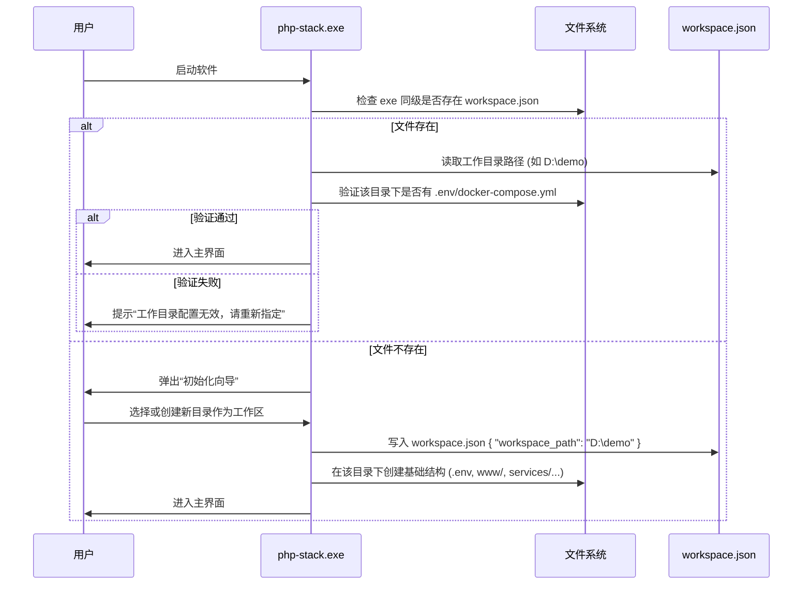
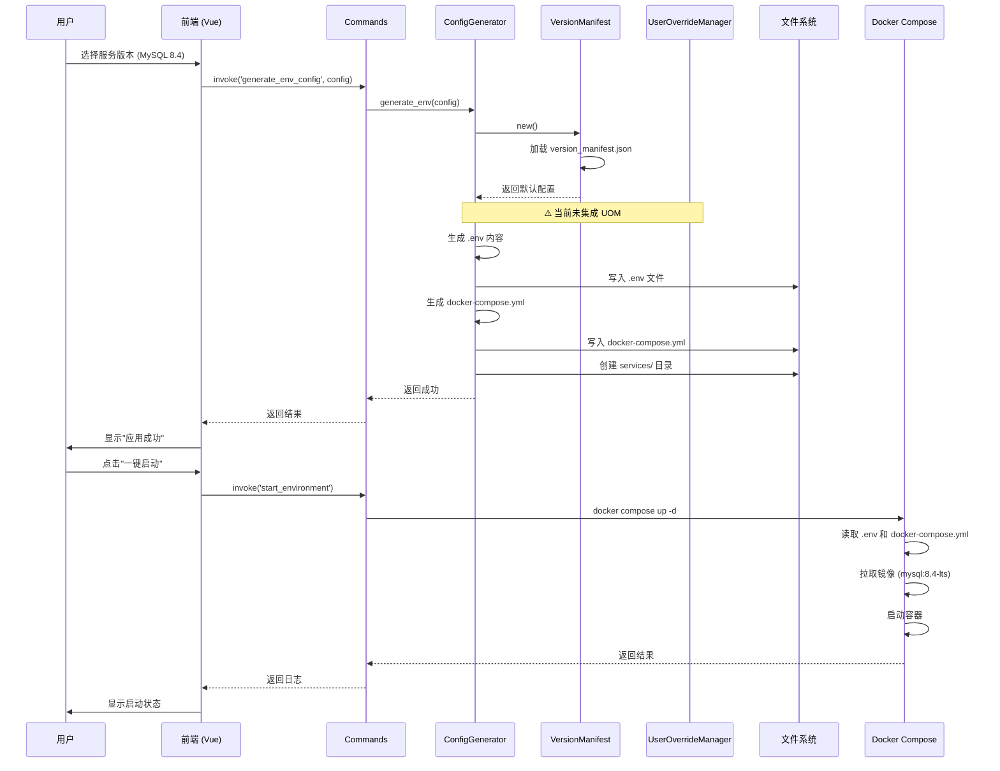
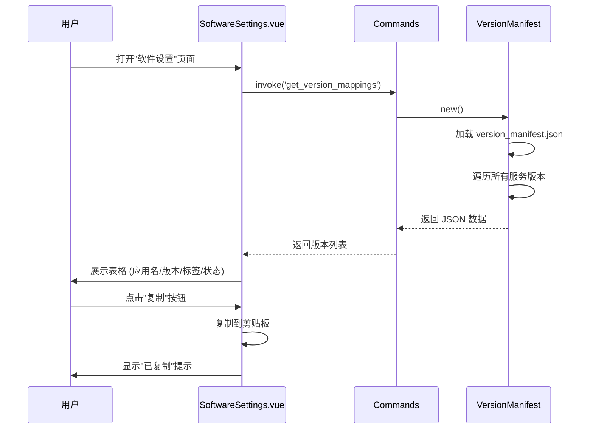
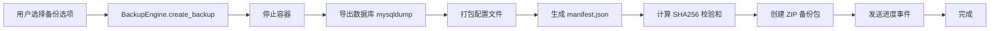

# PHP-Stack 系统架构文档

> **版本**: V2.2  
> **最后更新**: 2026-04-21  
> **维护者**: PHP-Stack Team

---

## 📋 目录

- [1. 项目概述](#1-项目概述)
- [2. 系统架构图](#2-系统架构图)
- [3. 核心工作流程](#3-核心工作流程)
- [4. 模块详细说明](#4-模块详细说明)
- [5. 数据流图](#5-数据流图)
- [6. 关键技术决策](#6-关键技术决策)
- [7. 扩展指南](#7-扩展指南)

---

## 1. 项目概述

### 1.1 项目定位

PHP-Stack 是一个基于 **Tauri v2 + Docker** 的跨平台 PHP 开发环境可视化管理工具。

**核心价值**：
- 🎯 **可视化配置** - 替代手动编辑 `.env` 和 `docker-compose.yml`
- 🚀 **镜像源加速** - 统一管理 Docker/APT/Composer/NPM 镜像源
- 💾 **环境备份恢复** - ZIP 格式打包，支持 SHA256 完整性校验
- 🔧 **多版本管理** - 支持 PHP/MySQL/Redis/Nginx 多版本共存

### 1.2 技术栈

| 层级 | 技术 | 说明 |
|------|------|------|
| **前端** | Vue 3 + TypeScript | UI 界面 |
| **样式** | Tailwind CSS v4 | 响应式设计 |
| **后端** | Rust (Tauri v2) | 系统级操作 |
| **容器** | Docker + Docker Compose | 环境隔离 |
| **Docker SDK** | bollard | Rust 的 Docker API 客户端 |

---

## 2. 系统架构图

```
┌─────────────────────────────────────────────────────────────┐
│                        前端层 (Vue 3)                        │
├─────────────────────────────────────────────────────────────┤
│  App.vue (主框架)                                            │
│  ├── EnvConfigPage.vue      (环境配置)                       │
│  ├── MirrorPanel.vue          (镜像源管理)                   │
│  ├── BackupPage.vue           (环境备份)                     │
│  ├── RestorePage.vue          (环境恢复)                     │
│  └── SoftwareSettings.vue     (软件设置/版本映射)            │
└──────────────────────┬──────────────────────────────────────┘
                       │ Tauri IPC (invoke)
┌──────────────────────▼──────────────────────────────────────┐
│                      后端层 (Rust/Tauri)                     │
├─────────────────────────────────────────────────────────────┤
│  commands.rs (API 命令入口)                                  │
│  ├── check_docker / list_containers                         │
│  ├── generate_env_config / apply_env_config                 │
│  ├── get_mirror_presets / apply_mirror_preset               │
│  ├── create_backup / preview_restore                        │
│  └── get_version_mappings / validate_version                │
├─────────────────────────────────────────────────────────────┤
│  engine/ (核心业务引擎)                                      │
│  ├── config_generator.rs       (配置生成器)                  │
│  ├── version_manifest.rs       (版本清单管理器)              │
│  ├── user_override_manager.rs  (用户覆盖管理器) ⚠️          │
│  ├── env_parser.rs             (.env 解析器)                │
│  ├── mirror_manager.rs         (镜像源管理器)               │
│  ├── backup_engine.rs          (备份引擎)                   │
│  └── restore_engine.rs         (恢复引擎)                   │
├─────────────────────────────────────────────────────────────┤
│  docker/ (Docker 交互层)                                     │
│  ├── manager.rs                (容器管理)                    │
│  └── mirror.rs                 (镜像源切换)                  │
└──────────────────────┬──────────────────────────────────────┘
                       │ bollard (Docker SDK)
┌──────────────────────▼──────────────────────────────────────┐
│                     Docker Engine                            │
├─────────────────────────────────────────────────────────────┤
│  Containers: ps-php85, ps-mysql57, ps-redis72, ps-nginx127  │
│  Networks: php-stack-network                                 │
│  Volumes: data/, logs/                                       │
└─────────────────────────────────────────────────────────────┘
```

**⚠️ 注意**: `user_override_manager.rs` 已实现但未完全集成到配置生成流程中。

---

## 3. 核心工作流程

### 3.0 工作目录初始化流程 (Workspace Initialization)

**设计理念**：解耦软件本体与业务数据，实现跨平台无缝迁移。



**配置文件格式 (`workspace.json`)**:
```json
{
  "workspace_path": "D:\\demo",
  "last_updated": "2026-04-21T10:00:00Z"
}
```

**备份与恢复逻辑**:
*   **备份**: 仅打包 `workspace.json` 中指定的目录内容。任何位于该目录之外的文件（如用户手动选择的系统级配置文件）均不予备份，并在 UI 层给予明确提示。
*   **恢复**: 在新环境（如 macOS）中，用户先指定一个新的工作目录路径，软件将 ZIP 包内的所有内容解压至该路径，并自动更新本地的 `workspace.json`。

---

### 3.1 环境配置与启动流程（主要流程）



### 3.2 版本映射查询流程



### 3.3 备份流程



---

## 4. 模块详细说明

### 4.1 配置生成器 (ConfigGenerator)

**位置**: `src-tauri/src/engine/config_generator.rs`

**职责**:
- 根据用户选择生成 `.env` 文件
- 生成 `docker-compose.yml` 文件
- 创建 `services/` 目录结构并复制模板

**关键方法**:
```rust
pub fn generate_env(config: &EnvConfig) -> EnvFile
pub fn generate_compose(config: &EnvConfig) -> String
pub fn generate_service_dirs(config: &EnvConfig, root: &Path) -> Result<(), String>
```

**版本映射集成**:
```rust
// 当前实现
let manifest = VersionManifest::new();
let image_tag = manifest
    .get_image_info(&VmServiceType::Mysql, &service.version)
    .map(|info| info.tag.clone())
    .unwrap_or(service.version.clone());

env.set("MYSQL84_VERSION", &image_tag); // "8.4-lts"
```

### 4.2 版本清单管理器 (VersionManifest)

**位置**: `src-tauri/src/engine/version_manifest.rs`  
**数据文件**: `src-tauri/services/version_manifest.json`

**职责**:
- 管理服务版本与 Docker 镜像标签的映射
- 提供版本验证和推荐功能
- 检测 EOL (End of Life) 版本

**数据结构**:
```json
{
  "mysql": {
    "8.4": {
      "image": "mysql",
      "tag": "8.4-lts",
      "eol": false,
      "description": "MySQL 8.4 LTS (最新长期支持版)"
    }
  }
}
```

**关键方法**:
```rust
pub fn get_image_info(service_type, version) -> Option<&ImageInfo>
pub fn get_full_image_name(service_type, version) -> Option<String>
pub fn is_version_valid(service_type, version) -> bool
pub fn get_recommended_version(service_type) -> Option<&String>
```

### 4.3 用户覆盖管理器 (UserOverrideManager) ⚠️

**位置**: `src-tauri/src/engine/user_override_manager.rs`  
**配置文件**: `src-tauri/.user_version_overrides.json`

**状态**: ✅ 核心逻辑已实现，❌ 未集成到配置生成流程

**设计目标**:
- 允许用户自定义特定版本的 Docker 标签
- 优先级：用户配置 > 默认配置
- 支持保存/删除/重置操作

**合并策略**:
```rust
pub fn get_merged_image_info(&self, service_type, version) -> Option<ImageInfo> {
    // 1. 检查用户是否有覆盖配置
    if let Some(user_override) = self.user_overrides.get(...).and_then(...) {
        // 2. 获取默认配置作为基础
        if let Some(default_info) = self.default_manifest.get_image_info(...) {
            // 3. 返回合并后的配置（用户 tag 优先）
            return Some(ImageInfo {
                tag: user_override.tag.clone(), // ← 用户覆盖
                ..default_info.clone()
            });
        }
    }
    // 4. 没有用户覆盖，返回默认配置
    self.default_manifest.get_image_info(...)
}
```

**待完成工作**:
1. 在 `config_generator.rs` 中使用 `UserOverrideManager` 替代 `VersionManifest`
2. 添加后端 Command API (`save_user_override`, `remove_user_override`)
3. 前端添加编辑 UI

### 4.4 其他核心模块

| 模块 | 位置 | 职责 |
|------|------|------|
| **EnvParser** | `env_parser.rs` | .env 文件解析与格式化，保留注释 |
| **MirrorManager** | `mirror_manager.rs` | 统一镜像源管理（Docker/APT/Composer/NPM） |
| **BackupEngine** | `backup_engine.rs` | 环境备份（ZIP + manifest + SHA256） |
| **RestoreEngine** | `restore_engine.rs` | 环境恢复（验证 + 还原） |
| **DockerManager** | `docker/manager.rs` | 容器列表、启停操作 |

---

## 5. 数据流图

### 5.1 配置文件生成数据流

```
用户输入 (GUI)
    ↓
EnvConfig { services: [...], source_dir, timezone }
    ↓
ConfigGenerator.generate_env()
    ↓
VersionManifest.new() → 加载 version_manifest.json
    ↓
[可选] UserOverrideManager.new() → 加载 .user_version_overrides.json
    ↓
合并配置 (用户覆盖 > 默认)
    ↓
EnvFile { entries: [(key, value), ...] }
    ↓
写入 .env 文件
    ↓
ConfigGenerator.generate_compose()
    ↓
写入 docker-compose.yml
    ↓
ConfigGenerator.generate_service_dirs()
    ↓
创建 services/{php85,mysql57,...}/ 目录
    ↓
复制模板文件 (Dockerfile, php.ini, mysql.cnf, ...)
```

### 5.2 版本映射数据流

```
version_manifest.json (静态数据)
    ↓
VersionManifest::new() (嵌入到二进制)
    ↓
get_image_info("mysql", "8.4")
    ↓
ImageInfo { image: "mysql", tag: "8.4-lts", eol: false }
    ↓
full_name() → "mysql:8.4-lts"
    ↓
写入 .env: MYSQL84_VERSION=8.4-lts
    ↓
docker-compose.yml: image: mysql:${MYSQL84_VERSION}
    ↓
Docker Compose 解析 → 拉取 mysql:8.4-lts
```

---

## 6. 关键技术决策

### 6.1 为什么使用版本清单系统？

**问题**:
- 用户选择版本号 `8.4`，但 Docker Hub 上的标签可能是 `8.4-lts`
- 不同服务的标签格式不一致（PHP: `8.4-fpm`, Redis: `7.2-alpine`）
- 新版本发布时需要多处修改代码

**解决方案**:
- 集中管理版本映射在 `version_manifest.json`
- 配置生成器自动查询正确的标签
- 添加新版本只需编辑 JSON 文件

**优势**:
- ✅ 解耦用户界面与 Docker 标签
- ✅ 单一数据源，易于维护
- ✅ 支持 EOL 检测和版本推荐

### 6.2 为什么采用用户覆盖机制？

**设计理念**:
- 默认配置由开发者维护（安全性）
- 高级用户可以自定义（灵活性）
- 平衡安全性和可控性

**实现策略**:
- 用户配置文件优先级高于默认配置
- 支持单个版本覆盖，不影响其他版本
- 可随时重置为默认配置

### 6.3 为什么使用 `${VAR}` 插值？

**docker-compose.yml 设计**:
```yaml
mysql84:
  image: mysql:${MYSQL84_VERSION}  # ← 使用变量
  ports:
    - "${MYSQL84_HOST_PORT}:3306"
```

**优势**:
- ✅ .env 和 docker-compose.yml 解耦
- ✅ 修改配置无需重新生成 compose 文件
- ✅ 符合 Docker Compose 最佳实践

---

## 7. 扩展指南

### 7.1 添加新的服务版本

**步骤 1**: 编辑 `version_manifest.json`
```json
{
  "mysql": {
    "9.0": {
      "image": "mysql",
      "tag": "9.0-innovation",
      "eol": false,
      "description": "MySQL 9.0 Innovation (创新版)"
    }
  }
}
```

**步骤 2**: 创建服务模板目录
```bash
mkdir -p src-tauri/services/mysql90
cp src-tauri/services/mysql80/mysql.cnf src-tauri/services/mysql90/
```

**步骤 3**: 重新编译
```bash
cd src-tauri && cargo build
```

**无需修改任何 Rust 代码！**

### 7.2 添加用户自定义标签

**方法 1: 手动编辑**（当前可用）
```json
// src-tauri/.user_version_overrides.json
{
  "mysql": {
    "8.4": {
      "tag": "8.4-lts-aliyun",
      "description": "使用阿里云镜像"
    }
  }
}
```

**方法 2: 通过 UI**（待实现）
1. 打开"软件设置"页面
2. 点击版本行的"编辑"按钮
3. 输入新的标签和描述
4. 点击"保存"

### 7.3 添加新的后端 Command

**步骤 1**: 在 `commands.rs` 中添加函数
```rust
#[tauri::command]
pub fn my_new_command(param: String) -> Result<String, String> {
    // 实现逻辑
    Ok(format!("Result: {}", param))
}
```

**步骤 2**: 在 `lib.rs` 中注册
```rust
.invoke_handler(tauri::generate_handler![
    // ... 其他命令
    commands::my_new_command,
])
```

**步骤 3**: 前端调用
```typescript
const result = await invoke('my_new_command', { param: 'test' });
```

---

## 📚 附录

### A. 文件结构概览

```
php-stack/
├── src/                          # 前端代码
│   ├── components/
│   │   ├── EnvConfigPage.vue
│   │   ├── MirrorPanel.vue
│   │   ├── BackupPage.vue
│   │   ├── RestorePage.vue
│   │   └── SoftwareSettings.vue
│   └── types/
│       └── version-mapping.ts
├── src-tauri/
│   ├── src/
│   │   ├── commands.rs           # API 命令
│   │   ├── lib.rs                # 插件注册
│   │   ├── engine/
│   │   │   ├── config_generator.rs
│   │   │   ├── version_manifest.rs
│   │   │   ├── user_override_manager.rs
│   │   │   └── ...
│   │   └── docker/
│   │       └── manager.rs
│   ├── services/
│   │   ├── version_manifest.json  # 版本清单
│   │   ├── php85/
│   │   ├── mysql57/
│   │   └── ...
│   └── .user_version_overrides.json  # 用户覆盖配置
├── .env                          # 生成的环境变量
├── docker-compose.yml            # 生成的 Compose 文件
└── services/                     # 运行时服务目录
    ├── php85/
    ├── mysql57/
    └── ...
```

### B. 常用命令

```bash
# 开发模式
npm run tauri dev

# 运行测试
cd src-tauri && cargo test

# 构建生产版本
npm run tauri build

# 查看版本映射
cat src-tauri/services/version_manifest.json | jq
```

### C. 相关文档

- [VERSION_MANIFEST.md](./src-tauri/docs/VERSION_MANIFEST.md) - 版本清单系统详细说明
- [VERSION_MANIFEST_VERIFICATION.md](./src-tauri/docs/VERSION_MANIFEST_VERIFICATION.md) - 验证报告
- [README.md](./README.md) - 项目总览

---

**文档维护**: 每次重大架构变更时，请同步更新此文档。
