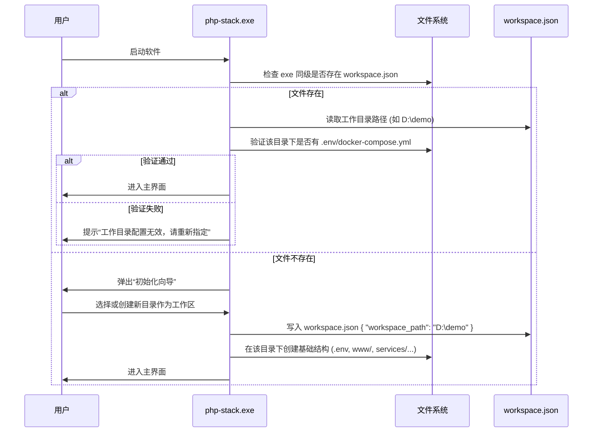
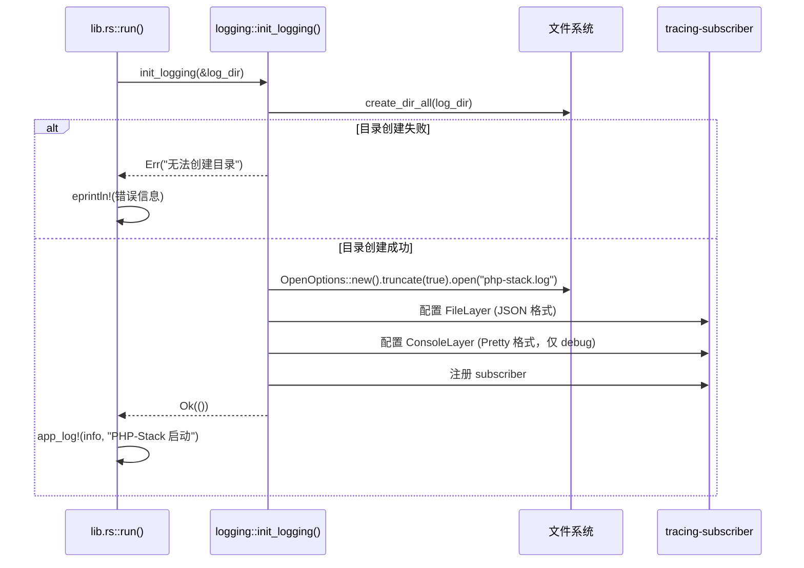
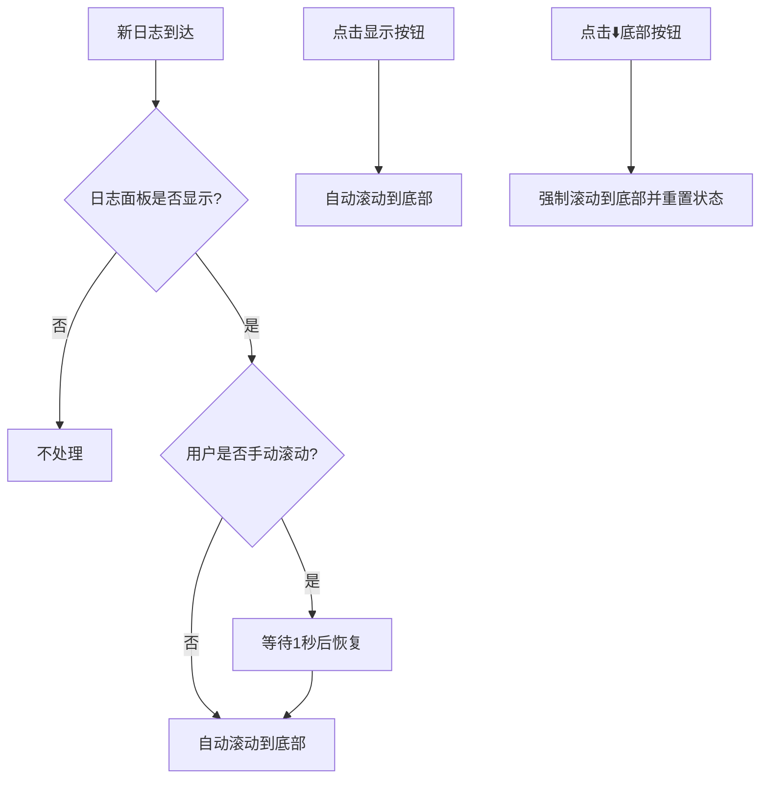
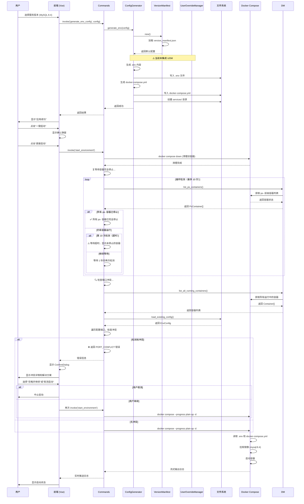
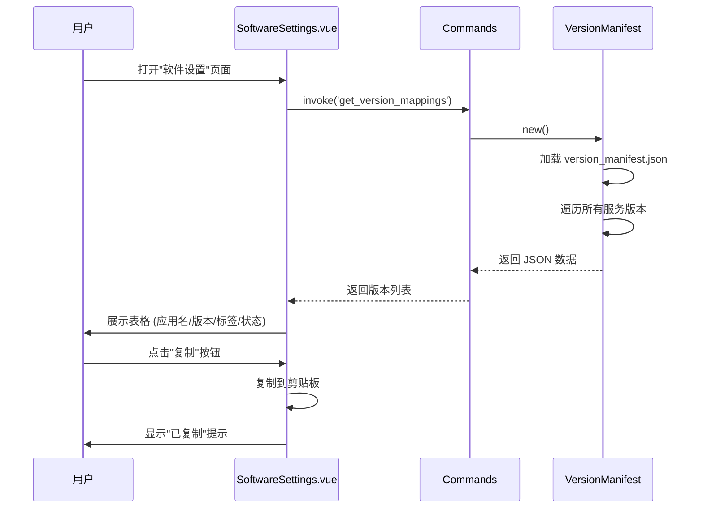
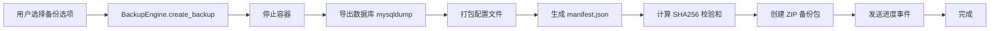
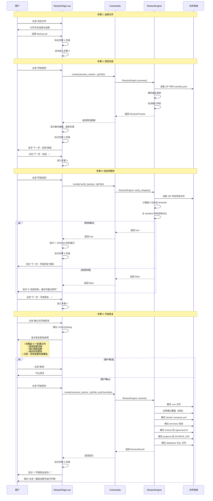
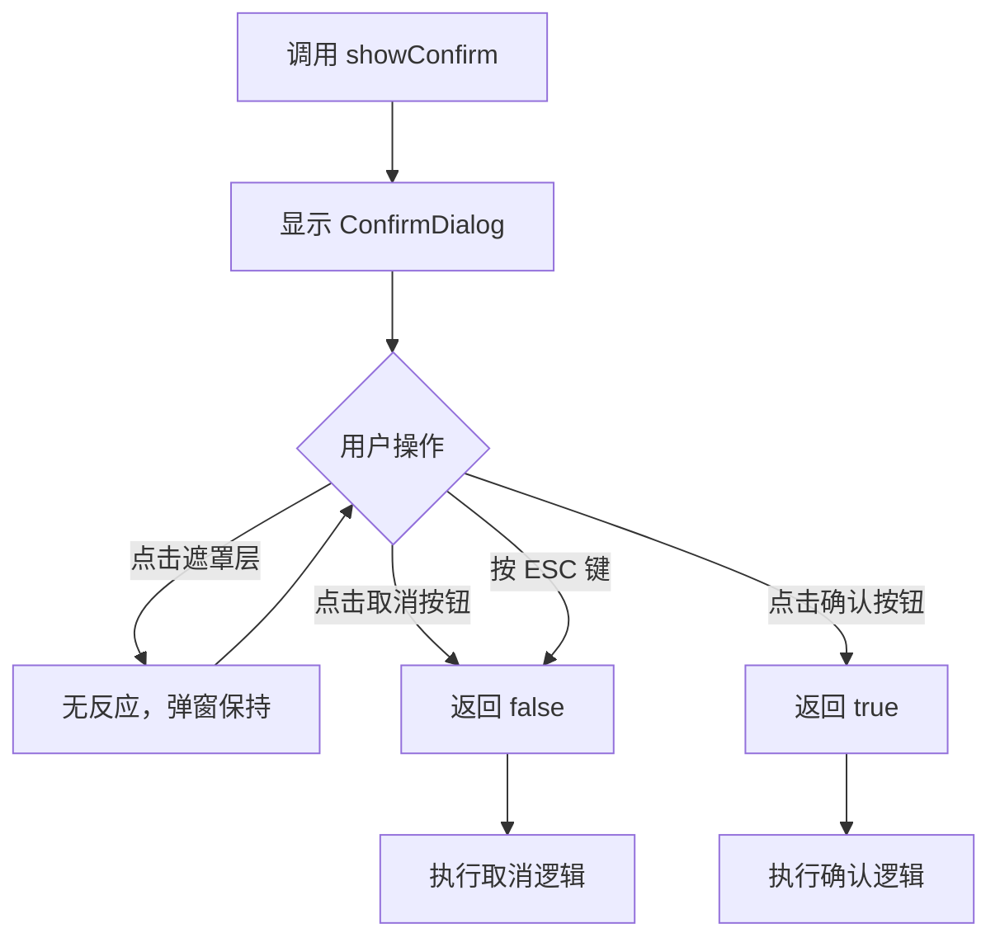

# PHP-Stack 系统架构文档

> **版本**: v0.1.0 (2026-04-24)  
> **最后更新**: 2026-04-24  
> **维护者**: PHP-Stack Team

---

## 📋 目录

- [1. 项目概述](#1-项目概述)
- [2. 系统架构图](#2-系统架构图)
- [3. 核心工作流程](#3-核心工作流程)
  - [3.0 工作目录初始化流程](#30-工作目录初始化流程-workspace-initialization)
  - [3.0.5 实时日志工作流程](#305-实时日志工作流程-real-time-logging)
  - [3.1 环境配置与启动流程](#31-环境配置与启动流程主要流程)
  - [3.2 版本映射查询流程](#32-版本映射查询流程)
  - [3.3 备份流程](#33-备份流程)
  - [3.4 环境恢复流程](#34-环境恢复流程分步卡片式交互)
- [4. 模块详细说明](#4-模块详细说明)
- [5. 数据流图](#5-数据流图)
- [6. 关键技术决策](#6-关键技术决策)
- [7. 扩展指南](#7-扩展指南)

---

## 1. 项目概述

### 1.1 项目定位

PHP-Stack 是一个基于 **Tauri v2 + Docker** 的跨平台 PHP 开发环境可视化管理工具。

**核心价值**：
- 🎯 **可视化配置** - 替代手动编辑 `.env` 和 `docker-compose.yml`
- 🚀 **镜像源加速** - 统一管理 Docker/APT/Composer/NPM 镜像源
- 💾 **环境备份恢复** - ZIP 格式打包，支持 SHA256 完整性校验
- 🔧 **多版本管理** - 支持 PHP/MySQL/Redis/Nginx 多版本共存
- 🔄 **动态基础镜像** - 用户可自由切换 Debian/Alpine 或自定义镜像标签

### 1.2 技术栈

| 层级 | 技术 | 说明 |
|------|------|------|
| **前端** | Vue 3 + TypeScript | UI 界面 |
| **样式** | Tailwind CSS v4 | 响应式设计 |
| **后端** | Rust (Tauri v2) | 系统级操作 |
| **容器** | Docker + Docker Compose | 环境隔离 |
| **Docker SDK** | bollard | Rust 的 Docker API 客户端 |

---

## 2. 系统架构图

```
┌─────────────────────────────────────────────────────────────┐
│                        前端层 (Vue 3)                        │
├─────────────────────────────────────────────────────────────┤
│  App.vue (主框架)                                            │
│  ├── EnvConfigPage.vue      (环境配置)                       │
│  ├── MirrorPanel.vue          (镜像源管理)                   │
│  ├── BackupPage.vue           (环境备份)                     │
│  ├── RestorePage.vue          (环境恢复)                     │
│  └── SoftwareSettings.vue     (软件设置/版本映射)            │
└──────────────────────┬──────────────────────────────────────┘
                       │ Tauri IPC (invoke)
┌──────────────────────▼──────────────────────────────────────┐
│                      后端层 (Rust/Tauri)                     │
├─────────────────────────────────────────────────────────────┤
│  commands.rs (API 命令入口)                                  │
│  ├── check_docker / list_containers                         │
│  ├── generate_env_config / apply_env_config                 │
│  ├── get_mirror_presets / apply_mirror_preset               │
│  ├── create_backup / preview_restore                        │
│  └── get_version_mappings / validate_version                │
├─────────────────────────────────────────────────────────────┤
│  engine/ (核心业务引擎)                                      │
│  ├── config_generator.rs       (配置生成器 + 动态镜像切换)   │
│  ├── version_manifest.rs       (版本清单管理器)              │
│  ├── user_override_manager.rs  (用户覆盖管理器) ✅          │
│  ├── env_parser.rs             (.env 解析器)                │
│  ├── mirror_manager.rs         (镜像源管理器)               │
│  ├── backup_engine.rs          (备份引擎)                   │
│  └── restore_engine.rs         (恢复引擎)                   │
├─────────────────────────────────────────────────────────────┤
│  docker/ (Docker 交互层)                                     │
│  ├── manager.rs                (容器管理)                    │
│  └── mirror.rs                 (镜像源切换)                  │
└──────────────────────┬──────────────────────────────────────┘
                       │ bollard (Docker SDK)
┌──────────────────────▼──────────────────────────────────────┐
│                     Docker Engine                            │
├─────────────────────────────────────────────────────────────┤
│  Containers: ps-php85, ps-mysql57, ps-redis72, ps-nginx127  │
│  Networks: php-stack-network                                 │
│  Volumes: data/, logs/                                       │
└─────────────────────────────────────────────────────────────┘
```

**✅ 注意**: `user_override_manager.rs` 已完全集成到配置生成流程中，支持用户自定义镜像标签。

---

## 3. 核心工作流程

### 3.0 工作目录初始化流程 (Workspace Initialization)

**设计理念**：解耦软件本体与业务数据，实现跨平台无缝迁移。



**配置文件格式 (`workspace.json`)**:
```json
{
  "workspace_path": "D:\\demo",
  "last_updated": "2026-04-21T10:00:00Z"
}
```

**备份与恢复逻辑**:
*   **备份**: 仅打包 `workspace.json` 中指定的目录内容。任何位于该目录之外的文件（如用户手动选择的系统级配置文件）均不予备份，并在 UI 层给予明确提示。
*   **恢复**: 在新环境（如 macOS）中，用户先指定一个新的工作目录路径，软件将 ZIP 包内的所有内容解压至该路径，并自动更新本地的 `workspace.json`。

---

### 3.0.5 实时日志工作流程 (Real-time Logging)

**设计理念**：三层日志架构，兼顾持久化、调试和用户体验。

#### 1. 日志架构概览

PHP-Stack 采用**三层日志系统**，分别服务于不同场景：

| 层级 | 目标 | 用途 | 特性 |
|------|------|------|------|
| **文件日志** | `php-stack.log` | 问题排查、审计 | 持久化、完整记录、每次启动覆盖 |
| **控制台日志** | 终端输出 | 开发调试 | 彩色格式化、实时显示 |
| **UI 日志** | 前端面板 | 用户反馈 | 实时推送、自动滚动、可复制 |

#### 2. 后端日志初始化流程



**关键代码** ([lib.rs](file:///e:/study/php-stack/src-tauri/src/lib.rs)):
```rust
pub fn run() {
    tauri::Builder::default()
        .setup(|app| {
            // 获取项目根目录（优先 workspace.json，否则 exe 同级目录）
            let log_dir = if cfg!(debug_assertions) {
                // 开发模式：使用项目根目录
                std::env::current_exe()
                    .ok()
                    .and_then(|p| p.parent().and_then(|p| p.parent())
                        .and_then(|p| p.parent()).and_then(|p| p.parent())
                        .map(|p| p.to_path_buf()))
                    .unwrap_or_else(|| std::path::PathBuf::from("."))
            } else {
                // 生产模式：使用可执行文件所在目录
                std::env::current_exe()
                    .ok()
                    .and_then(|p| p.parent().map(|p| p.to_path_buf()))
                    .unwrap_or_else(|| std::path::PathBuf::from("."))
            };
            
            // 初始化日志系统
            if let Err(e) = logging::init_logging(&log_dir) {
                eprintln!("Failed to initialize logging: {}", e);
            }
            
            app_log!(info, "app", "PHP-Stack 启动，日志文件位于: {:?}", log_dir.join("php-stack.log"));
            // ...
        })
}
```

**日志模块实现** ([logging.rs](file:///e:/study/php-stack/src-tauri/src/logging.rs)):
```rust
pub fn init_logging(app_data_dir: &PathBuf) -> Result<(), String> {
    // 确保目录存在
    std::fs::create_dir_all(app_data_dir)
        .map_err(|e| format!("无法创建应用数据目录 {:?}: {}", app_data_dir, e))?;
    
    let log_path = app_data_dir.join("php-stack.log");
    
    // 每次启动时覆盖写入（truncate）
    let file = OpenOptions::new()
        .create(true)
        .write(true)
        .truncate(true)  // 关键：覆盖旧日志
        .open(&log_path)
        .map_err(|e| format!("无法创建日志文件 {:?}: {}", log_path, e))?;
    
    // 配置 tracing subscriber
    let file_layer = tracing_subscriber::fmt::layer()
        .with_writer(file)
        .with_ansi(false)
        .json();
    
    let console_layer = tracing_subscriber::fmt::layer()
        .with_ansi(true)
        .pretty();
    
    tracing_subscriber::registry()
        .with(file_layer)
        .with(console_layer)
        .init();
    
    Ok(())
}
```

#### 3. 日志宏定义与使用

**宏定义** ([logging.rs](file:///e:/study/php-stack/src-tauri/src/logging.rs)):
```rust
/// 应用日志宏 - 同时输出到文件和 Tauri 事件
#[macro_export]
macro_rules! app_log {
    ($level:ident, $target:expr, $($arg:tt)*) => {{
        use tracing::{event, Level};
        let level = match stringify!($level) {
            "error" => Level::ERROR,
            "warn" => Level::WARN,
            "info" => Level::INFO,
            "debug" => Level::DEBUG,
            _ => Level::INFO,
        };
        
        let msg = format!($($arg)*);
        
        // 1. 输出到 tracing（文件 + 控制台）
        event!(target: $target, level, "{}", msg);
        
        // 2. 发送到前端 UI（通过 Tauri 事件）
        if let Some(handle) = $crate::get_app_handle() {
            let _ = handle.emit("env-log", &msg);
        }
    }};
}
```

**使用示例**:
```rust
// 在 commands.rs 中
#[tauri::command]
pub fn start_environment(app_handle: tauri::AppHandle) -> Result<(), String> {
    app_log!(info, "start_env", "开始启动环境...");
    
    // 清理旧容器
    app_log!(info, "start_env", "正在清理旧容器...");
    manager.stop_all_ps_containers().await?;
    
    // 等待容器停止
    app_log!(info, "start_env", "等待容器完全停止...");
    wait_for_containers_to_stop(&manager).await?;
    
    // 检查端口冲突
    app_log!(info, "start_env", "检查端口冲突...");
    check_port_conflicts(&config)?;
    
    // 启动容器
    app_log!(info, "start_env", "启动 Docker Compose...");
    docker_compose_up().await?;
    
    app_log!(info, "start_env", "✅ 环境启动成功！");
    Ok(())
}
```

#### 4. 前端日志接收与显示

**日志状态管理** ([useToast.ts](file:///e:/study/php-stack/src/composables/useToast.ts)):
```typescript
const logs = ref<string[]>([]);

export function addLog(message: string) {
  const time = new Date().toLocaleTimeString();
  logs.value.push(`[${time}] ${message}`);  // 最新在下
  if (logs.value.length > 50) logs.value.shift();  // 保留最近 50 条
}

export function getLogs() {
  return logs;
}
```

**事件监听** ([App.vue](file:///e:/study/php-stack/src/App.vue)):
```typescript
onMounted(() => {
  // 监听后端发送的日志事件
  listen('env-log', (event) => {
    const msg = event.payload as string;
    addLog(msg);
  });
});
```

#### 5. 自动滚动优化机制

**问题**：日志面板需要自动滚动到底部，但不能干扰用户手动阅读。

**解决方案**：智能滚动策略



**实现代码** ([App.vue](file:///e:/study/php-stack/src/App.vue)):
```typescript
const logPanelRef = ref<HTMLElement | null>(null);
const isUserScrolling = ref(false);
let scrollTimeout: ReturnType<typeof setTimeout> | null = null;

// 监听日志变化，自动滚动到底部（用户未手动滚动时）
watch(logs, async () => {
  await nextTick();
  if (logPanelRef.value && !isUserScrolling.value) {
    logPanelRef.value.scrollTop = logPanelRef.value.scrollHeight;
  }
}, { deep: true });

// 监听日志面板显示状态，显示时自动滚动到底部
watch(showLogs, async (newValue) => {
  if (newValue) {
    await nextTick();
    if (logPanelRef.value) {
      logPanelRef.value.scrollTop = logPanelRef.value.scrollHeight;
    }
  }
});

// 处理用户手动滚动
const handleLogScroll = () => {
  isUserScrolling.value = true;
  
  if (scrollTimeout) {
    clearTimeout(scrollTimeout);
  }
  
  // 1秒后恢复自动滚动
  scrollTimeout = setTimeout(() => {
    isUserScrolling.value = false;
  }, 1000);
};

// 手动滚动到底部
const scrollToBottom = async () => {
  await nextTick();
  if (logPanelRef.value) {
    logPanelRef.value.scrollTop = logPanelRef.value.scrollHeight;
    isUserScrolling.value = false; // 重置手动滚动状态
  }
};
```

**UI 模板**:
```vue
<div 
  ref="logPanelRef"
  @scroll="handleLogScroll"
  class="bg-black/40 p-4 rounded-xl font-mono text-sm h-40 overflow-y-auto"
>
  <div v-for="(log, i) in logs" :key="i" class="mb-1">
    {{ log }}
  </div>
</div>

<!-- 控制按钮 -->
<button @click="scrollToBottom">⬇️ 底部</button>
<button @click="copyLogs">📋 复制</button>
<button @click="showLogs = !showLogs">{{ showLogs ? '隐藏' : '显示' }}</button>
```

#### 6. 日志复制功能

**权限配置** ([capabilities/default.json](file:///e:/study/php-stack/src-tauri/capabilities/default.json)):
```json
{
  "permissions": [
    "core:default",
    "dialog:default",
    "dialog:allow-save",
    "log:default",
    "clipboard-manager:allow-write-text"  // ✅ 剪贴板写权限
  ]
}
```

**导出日志命令** ([commands.rs](file:///e:/study/php-stack/src-tauri/src/commands.rs)):
```rust
#[tauri::command]
pub fn export_logs() -> Result<String, String> {
    // 获取项目根目录（与 get_project_root 逻辑一致）
    let log_dir = if cfg!(debug_assertions) {
        std::env::current_exe()
            .map_err(|e| format!("获取程序路径失败: {}", e))?
            .parent()
            .and_then(|p| p.parent())
            .and_then(|p| p.parent())
            .and_then(|p| p.parent())
            .ok_or("无法获取项目根目录")?
            .to_path_buf()
    } else {
        std::env::current_exe()
            .map_err(|e| format!("获取程序路径失败: {}", e))?
            .parent()
            .ok_or("无法获取程序所在目录")?
            .to_path_buf()
    };
    
    let log_path = log_dir.join("php-stack.log");
    
    if !log_path.exists() {
        return Err("日志文件不存在，请先执行一些操作".to_string());
    }
    
    std::fs::read_to_string(&log_path)
        .map_err(|e| format!("读取日志失败: {}", e))
}
```

**前端调用** ([App.vue](file:///e:/study/php-stack/src/App.vue)):
```typescript
async function copyLogs() {
  try {
    const logs = await invoke('export_logs');
    await writeText(logs as string);
    showToast('日志已复制到剪贴板', 'success');
  } catch (e) {
    showToast(`复制失败: ${e}`, 'error');
  }
}
```

#### 7. 关键技术决策

##### 7.1 为什么每次启动覆盖日志文件？

**优势**:
- ✅ **文件大小可控**：避免日志文件无限增长
- ✅ **聚焦当前会话**：便于排查最近的问题
- ✅ **简化维护**：无需实现日志轮转逻辑

**劣势**:
- ❌ 历史日志丢失

**权衡**：对于开发工具，当前会话日志足够，如需长期保存可使用系统日志工具。

##### 7.2 为什么使用 Tauri 事件而非 WebSocket？

**优势**:
- ✅ **零配置**：Tauri 内置事件系统，无需额外依赖
- ✅ **类型安全**：Rust 和 TypeScript 双向类型检查
- ✅ **轻量级**：无网络开销，IPC 直接通信

**适用场景**：桌面应用内部通信

##### 7.3 为什么限制日志数量为 50 条？

**考虑因素**:
- **内存占用**：每条日志约 100 字节，50 条约 5KB
- **渲染性能**：DOM 节点过多会影响滚动流畅度
- **用户体验**：用户通常只关注最近的日志

**可扩展性**：如需查看完整日志，使用"复制"功能获取文件日志。

##### 7.4 为什么手动滚动后 1 秒恢复？

**设计原则**:
- **不打扰阅读**：给用户足够时间查看历史日志
- **及时恢复**：1 秒后大概率用户已完成阅读
- **平衡体验**：既不过于激进也不过于保守

**对比方案**:
- 3 秒：太长，可能错过重要日志
- 0.5 秒：太短，用户还在阅读就被打断
- 1 秒：经验值，符合大多数用户习惯

#### 8. 相关文件清单

| 文件 | 职责 |
|------|------|
| `src-tauri/src/logging.rs` | 日志基础设施（tracing 配置、宏定义） |
| `src-tauri/src/lib.rs` | 日志系统初始化 |
| `src-tauri/src/commands.rs` | 导出日志命令 |
| `src/composables/useToast.ts` | 前端日志状态管理 |
| `src/App.vue` | 日志面板 UI、事件监听、自动滚动 |
| `src-tauri/capabilities/default.json` | 剪贴板权限配置 |

#### 9. 测试建议

**手动测试场景**:
1. **启动应用**：检查 `php-stack.log` 是否生成
2. **执行操作**：点击"一键启动"，观察日志面板实时更新
3. **手动滚动**：向上滚动查看历史日志，等待 1 秒后新增日志应自动滚动
4. **显示/隐藏**：切换日志面板，打开时应自动滚动到底部
5. **复制日志**：点击"📋 复制"，粘贴到文本编辑器验证完整性
6. **长时间运行**：连续操作 50+ 次，确认日志数量不超过 50 条

**自动化测试**（待实现）:
```typescript
// src/composables/__tests__/useToast.spec.ts
describe('addLog', () => {
  it('should add log with timestamp', () => {
    addLog('Test message');
    expect(logs.value[0]).toMatch(/\[\d+:\d+:\d+\] Test message/);
  });
  
  it('should limit to 50 logs', () => {
    for (let i = 0; i < 60; i++) {
      addLog(`Log ${i}`);
    }
    expect(logs.value.length).toBe(50);
    expect(logs.value[0]).toContain('Log 10'); // 最早的应该是第 11 条
  });
});
```

---

### 3.1 环境配置与启动流程（主要流程）

#### 3.1.1 配置应用与备份机制

**设计理念**：采用 ZIP 打包方式备份配置文件，确保数据安全且易于管理。

```mermaid
sequenceDiagram
    participant U as 用户
    participant FE as 前端 (Vue)
    participant CMD as Commands
    participant CG as ConfigGenerator
    participant FS as 文件系统
    participant ZIP as ZIP Writer

    U->>FE: 选择服务版本并点击"应用配置"
    FE->>FE: 检查配置文件是否存在
    alt 文件存在
        FE->>U: 显示确认对话框（是否备份）
        U->>FE: 勾选"备份现有配置"
    end
    FE->>CMD: invoke('apply_env_config', config, enableBackup=true)
    CMD->>CG: ConfigGenerator::apply(config, enable_backup=true)
    
    Note over CG,ZIP: 阶段 1: 预检查备份
    CG->>FS: 检查 .env, docker-compose.yml, services/ 是否存在
    FS-->>CG: 返回存在的文件列表
    CG->>CG: 生成备份文件名: config_backup_YYYYMMDD_HHMMSS.zip
    CG->>FS: 检查 ZIP 文件是否已存在
    alt ZIP 已存在
        CG-->>CMD: Err("备份文件已存在")
        CMD-->>FE: 错误信息
        FE->>U: 提示删除旧备份后重试
    else ZIP 不存在
        CG-->>CG: 预检查通过
    end
    
    Note over CG,ZIP: 阶段 2: 执行 ZIP 打包备份
    CG->>ZIP: 创建 ZIP 文件
    loop 遍历每个配置项
        alt 文件 (.env, docker-compose.yml)
            CG->>FS: 读取文件内容
            FS-->>CG: 返回字节数据
            CG->>ZIP: start_file(filename)
            CG->>ZIP: write_all(content)
        else 目录 (services/)
            CG->>FS: 递归读取目录
            loop 遍历子文件
                CG->>ZIP: start_file(path)
                CG->>ZIP: write_all(content)
            end
        end
    end
    CG->>ZIP: finish()
    ZIP-->>CG: ZIP 文件创建完成
    CG-->>CMD: Ok(["config_backup_YYYYMMDD_HHMMSS.zip"])
    
    Note over CG,FS: 阶段 3: 生成新配置
    CMD->>CG: generate_env(config)
    CG->>FS: 写入 .env 文件
    CG->>CG: generate_compose(config)
    CG->>FS: 写入 docker-compose.yml
    CG->>FS: 创建 services/ 目录结构
    CG-->>CMD: Ok(backed_up_files)
    CMD-->>FE: 返回备份文件列表
    FE->>U: 显示"配置应用成功 + 备份信息"
end
```

**备份文件格式**：
- **命名规则**: `config_backup_YYYYMMDD_HHMMSS.zip`
- **示例**: `config_backup_20260424_180000.zip`
- **包含内容**:
  - `.env` - 环境变量配置文件
  - `docker-compose.yml` - Docker Compose 配置文件
  - `services/` - 服务配置目录（递归包含所有子文件）
  - `.user_mirror_config.json` - 用户镜像源配置（如果存在）
  - `.user_version_overrides.json` - 用户版本覆盖配置（如果存在）

**关键技术决策**：

##### 为什么采用 ZIP 打包而非文件重命名？

**对比分析**：

| 特性 | 旧方案（重命名） | 新方案（ZIP打包） |
|------|----------------|------------------|
| 文件管理 | 产生多个分散文件（`.env_20260424_180000`, `services_20260424_180000/`） | 单一ZIP文件，易于管理 |
| 磁盘空间 | 占用较多（无压缩） | 占用较少（Deflated压缩算法） |
| 清理难度 | 需手动删除多个文件 | 只需删除一个ZIP文件 |
| 备份完整性 | 可能部分失败导致混乱 | 容错处理，更可靠 |
| 回滚复杂度 | 需要复杂的重命名回滚逻辑 | 无需回滚，失败时直接删除ZIP |
| 可读性 | 文件名冗长难懂 | 清晰的命名格式 |
| 用户体验 | 工作目录杂乱 | 工作目录整洁 |

**实现优势**：
1. **简化错误处理**：
   - 旧方案：需要维护回滚列表，逐个恢复重命名的文件
   - 新方案：如果备份失败，直接删除未完成的 ZIP 文件即可

2. **容错性强**：
   - 单个文件读取失败不影响其他文件的备份
   - 自动跳过无法访问的文件，继续处理其他文件
   - 如果没有任何文件成功备份，自动删除空 ZIP 文件

3. **压缩效率高**：
   - 使用 Deflated 压缩算法
   - 典型配置文件压缩率可达 60-80%
   - 减少磁盘占用和备份时间

4. **便于归档**：
   - 单一文件易于复制、移动、删除
   - 可以使用标准 ZIP 工具查看内容
   - 方便用户手动备份到外部存储

**代码实现要点** ([config_generator.rs](file:///e:/study/php-stack/src-tauri/src/engine/config_generator.rs))：

```rust
// 预检查阶段
fn precheck_backup(project_root: &Path) -> Result<BackupState, String> {
    let timestamp = Local::now().format("%Y%m%d_%H%M%S").to_string();
    let backup_zip_name = format!("config_backup_{timestamp}.zip");
    let backup_zip_path = project_root.join(&backup_zip_name);
    
    // 只检查 ZIP 文件是否存在
    if backup_zip_path.exists() {
        return Err(format!("备份文件已存在，请删除后重试: {backup_zip_name}"));
    }
    
    Ok(BackupState::Ready { timestamp, items: existing_items })
}

// 执行备份阶段
fn execute_backup(state: BackupState, project_root: &Path) -> Result<Vec<String>, String> {
    // 创建 ZIP 文件
    let file = std::fs::File::create(&backup_zip_path)?;
    let mut zip = zip::ZipWriter::new(file);
    let zip_options = FileOptions::<()>::default()
        .compression_method(zip::CompressionMethod::Deflated);
    
    // 添加文件和目录
    for item in &items {
        if item_path.is_file() {
            let content = std::fs::read(&item_path)?;
            zip.start_file(item, zip_options)?;
            zip.write_all(&content)?;
        } else if item_path.is_dir() {
            Self::add_dir_to_zip_recursive(&mut zip, &item_path, item, zip_options)?;
        }
    }
    
    // 添加用户配置文件（与 backup_engine.rs 逻辑一致）
    let user_config_files = vec![
        ".user_mirror_config.json",
        ".user_version_overrides.json",
    ];
    
    for config_file in &user_config_files {
        let config_path = project_root.join(config_file);
        if config_path.exists() {
            let content = std::fs::read(&config_path)?;
            zip.start_file(config_file, zip_options)?;
            zip.write_all(&content)?;
        }
    }
    
    zip.finish()?;
    Ok(vec![backup_zip_name])
}

// 递归添加目录
fn add_dir_to_zip_recursive(
    zip: &mut zip::ZipWriter<std::fs::File>,
    dir_path: &Path,
    zip_base_path: &str,
    options: FileOptions<()>,
) -> Result<usize, String> {
    // 递归遍历目录，保持层级结构
    // 返回实际添加的文件数量
}
```

**用户体验优化**：

1. **明确的提示信息**：
   ```
   ✅ 配置已成功应用！
   
   ✅ 已备份 1 个文件/目录：
   • config_backup_20260424_180000.zip
   ```

2. **失败时的友好提示**：
   ```
   ⚠️ 注意：部分文件备份失败（可能文件被占用），
   请关闭相关程序后重试。
   ```

3. **备份文件位置**：
   - 保存在项目根目录（与 `.env` 同级）
   - 便于用户查找和管理
   - 不会被 Git 忽略（除非手动添加到 `.gitignore`）

**相关文件**：
- 后端实现：`src-tauri/src/engine/config_generator.rs`
- API 命令：`src-tauri/src/commands.rs::apply_env_config()`
- 前端调用：`src/components/EnvConfigPage.vue::handleApply()`



**端口冲突检测机制**：

#### 1. 检测时机
- **位置**: `start_environment` 命令中，清理旧容器后、启动新容器前
- **流程**: 
  ```
  清理旧容器 → 等待 ps- 容器停止 → 检查端口冲突 → 启动新容器
  ```

#### 2. 容器停止等待机制（循环检测）
- **目的**: 避免检测到正在停止的 ps- 容器，导致误判
- **实现**: 
  - 循环调用 `list_ps_containers()` 检查 ps- 前缀容器状态
  - 最多等待 10 次，每次间隔 1 秒
  - 所有 ps- 容器停止后立即继续，不浪费时间
  - 超时时显示未停止的容器列表，方便排查
- **优势**:
  - ✅ 自适应：不同机器、不同容器数量都能准确判断
  - ✅ 高效：容器停止后立即继续，不等固定时间
  - ✅ 可靠：基于 Docker API 实际状态，而非猜测

#### 3. 端口冲突检测方式
- **API**: `list_all_running_containers()` - 获取所有运行中的容器（包括外部容器）
- **冲突判断**: 遍历配置中的端口，检查是否被其他容器的 `ports` 数组占用
- **返回格式**: `PORT_CONFLICT:端口 X (服务A) 被容器 Y 占用; 端口 Z (服务B) 被容器 W 占用`

#### 4. 前端处理逻辑
- **错误捕获**: 检测 `errorMsg.startsWith('PORT_CONFLICT:')`
- **弹窗提示**: 使用 ConfirmDialog 显示冲突详情
- **用户选择**:
  - "取消启动": 终止流程，不执行 `docker compose up`
  - "忽略并继续": 再次调用 `start_environment`，跳过端口检查

#### 5. 整体优势
- ✅ **完全跨平台**: Docker API 统一接口，无需系统特定命令
- ✅ **精准定位**: 显示容器名、镜像、ID，而非进程名
- ✅ **无需权限**: 不需要 netstat/tasklist 等系统命令
- ✅ **用户友好**: 提供明确的解决命令和自定义弹窗
- ✅ **时序可靠**: 循环检测确保容器完全停止后再检查

### 3.2 版本映射查询流程



### 3.3 备份流程



### 3.4 环境恢复流程（分步卡片式交互）

**设计理念**：采用向导式分步卡片布局，用户主动控制节奏，避免信息过载。



**关键设计决策**：

#### 1. 分步卡片式布局
- **每个步骤独立卡片**：一次只显示当前步骤的内容
- **操作按钮固定在卡片底部**：无需滚动即可操作
- **平滑过渡动画**：300ms fade + slide 效果
- **视觉引导清晰**：蓝色“下一步”按钮引导用户继续

#### 2. 手动控制节奏
- **不自动跳转**：每步完成后停留在当前步骤
- **显示操作结果**：用户有足够时间查看信息
- **Toast 提示反馈**：告知用户当前状态
- **“下一步”按钮**：用户主动决定是否继续

#### 3. 职责分离原则
- **恢复 = 文件解压**：仅处理配置文件还原
- **启动 = 镜像拉取+容器运行**：在“一键启动”时处理
- **移除镜像检测**：避免用户在恢复阶段产生困惑
- **简化用户心智模型**：恢复和启动职责明确

#### 4. 端口冲突处理
- **预览时检测**：`detect_port_conflicts()` 检查端口占用
- **自动分配建议**：为每个冲突端口推荐可用端口
- **用户可修改**：提供输入框让用户自定义端口
- **恢复时应用**：`port_overrides` 参数应用到 .env 文件

#### 5. 完整性校验
- **SHA256 验证**：确保备份文件未被篡改
- **逐文件校验**：遍历 manifest 中的所有文件
- **即时反馈**：校验通过后才能进入下一步
- **安全保障**：防止损坏或恶意的备份包

**技术实现**：

```rust
// RestorePreview 结构体（精简版）
pub struct RestorePreview {
    pub manifest: BackupManifest,
    pub port_conflicts: Vec<PortConflict>,
    pub file_count: usize,
    // missing_images 字段已移除（职责分离）
}

// 恢复流程核心逻辑
pub async fn restore(
    zip_path: &str,
    project_root: &Path,
    port_overrides: HashMap<String, u16>,
    app_handle: Option<&tauri::AppHandle>,
) -> Result<RestoreResult, String> {
    // 1. 解析 manifest
    // 2. 解压 .env（应用端口覆盖）
    // 3. 解压 docker-compose.yml
    // 4. 解压 services/ 目录
    // 5. 解压 vhosts/ 到 nginx/conf.d/
    // 6. 解压 projects/ 到 SOURCE_DIR
    // 7. 解压 database/ SQL 文件
    // 8. 发送进度事件
}
```

**用户体验优化**：

| 方面 | 优化前 | 优化后 |
|------|--------|--------|
| **页面长度** | 很长，需要滚动 | 紧凑，一屏显示 |
| **操作按钮** | 在页面底部 | 固定在卡片底部 |
| **信息密度** | 高，容易 overwhelm | 低，一次专注一件事 |
| **视觉焦点** | 分散 | 集中在当前步骤 |
| **步骤切换** | 无动画 | 平滑过渡动画 |
| **用户控制** | 被动接受 | 主动决定 |
| **理解时间** | 不足 | 充足 |

**相关文件**：
- 前端：`src/components/RestorePage.vue`
- 后端：`src-tauri/src/engine/restore_engine.rs`
- 类型定义：`src/types/env-config.ts`

---

## 4. 模块详细说明

### 4.1 配置生成器 (ConfigGenerator)

**位置**: `src-tauri/src/engine/config_generator.rs`

**职责**:
- 根据用户选择生成 `.env` 文件
- 生成 `docker-compose.yml` 文件
- 创建 `services/` 目录结构并复制模板
- **支持动态基础镜像切换**（v0.1.0 新增）

**关键方法**:
```rust
pub fn generate_env(config: &EnvConfig) -> EnvFile
pub fn generate_compose(config: &EnvConfig) -> String
pub fn generate_service_dirs(config: &EnvConfig, root: &Path) -> Result<(), String>
```

#### 4.1.1 动态基础镜像切换机制

**设计理念**：通过 ARG + FROM 变量实现基础镜像的动态切换，用户无需修改 Dockerfile 源码。

**数据流向**:
```
用户配置 → .user_version_overrides.json / version_manifest.json
    ↓
config_generator.rs 获取完整镜像标签（如 php:8.2-fpm-alpine）
    ↓
写入 .env: PHP82_VERSION=php:8.2-fpm-alpine
    ↓
生成 docker-compose.yml:
  build:
    args:
      PHP_BASE_IMAGE: "${PHP82_VERSION}"
    ↓
Docker BuildKit 传递参数到 Dockerfile
    ↓
Dockerfile:
  ARG PHP_BASE_IMAGE=php:8.2-fpm
  FROM ${PHP_BASE_IMAGE}
    ↓
最终构建的容器基于用户指定的镜像
```

**Dockerfile 改造** (所有 PHP 版本):
```dockerfile
# Dynamic base image support
# Users can override by setting PHP82_VERSION in .env (e.g., php:8.2-fpm-alpine)
ARG PHP_BASE_IMAGE=php:8.2-fpm
FROM ${PHP_BASE_IMAGE}

ARG TZ
ARG PHP_EXTENSIONS
ARG DEBIAN_MIRROR_DOMAIN
...
```

**配置生成器实现** ([config_generator.rs](file:///e:/study/php-stack/src-tauri/src/engine/config_generator.rs)):

```rust
// generate_env() - 获取完整镜像标签
let manifest = VersionManifest::new();
let override_manager = UserOverrideManager::new(&project_root);

// 优先级：用户覆盖 > 默认清单
let image_tag = override_manager
    .get_merged_image_info(&VmServiceType::Php, &service.version)
    .map(|info| format!("{}:{}", info.image, info.tag))
    .unwrap_or_else(|| {
        manifest
            .get_image_info(&VmServiceType::Php, &service.version)
            .map(|info| format!("{}:{}", info.image, info.tag))
            .unwrap_or(format!("php:{}-fpm", service.version))
    });

// 写入 .env：PHP82_VERSION=php:8.2-fpm-alpine
env.set(&format!("PHP{ver}_VERSION"), &image_tag);

// generate_compose() - 传递参数到 Dockerfile
lines.push("      args:".to_string());
lines.push(format!("        PHP_BASE_IMAGE: \"${{PHP{ver}_VERSION}}\""));
```

**使用场景**:

| 场景 | .env 配置 | 说明 |
|------|----------|------|
| 切换到 Alpine | `PHP82_VERSION=php:8.2-fpm-alpine` | 减小镜像体积约 50-70 MB |
| 锁定小版本 | `PHP82_VERSION=php:8.2.15-fpm` | 确保环境一致性 |
| 自定义镜像 | `PHP82_VERSION=registry.example.com/php:8.2-custom` | 私有仓库或本地构建 |
| 测试新版 | `PHP83_VERSION=php:8.3.0RC3-fpm` | 提前体验新特性 |

**技术细节**:

1. **ARG 作用域规则**：
   - 在 FROM 之前定义的 ARG **只能**用于 FROM 指令
   - 如果要在 FROM 之后使用，需要重新声明（不赋值）
   - 我们的实现符合这个规则

2. **docker-compose build args 传递**：
   ```yaml
   build:
     args:
       PHP_BASE_IMAGE: "${PHP82_VERSION}"  # 从 .env 读取
   ```
   等价于：
   ```bash
   docker build --build-arg PHP_BASE_IMAGE=php:8.2-fpm-alpine ...
   ```

3. **默认值机制**：
   ```dockerfile
   ARG PHP_BASE_IMAGE=php:8.2-fpm  # 默认值
   FROM ${PHP_BASE_IMAGE}
   ```
   即使 `.env` 中没有定义该变量，构建也能正常进行。

**优势对比**:

| 特性 | 旧方案（硬编码） | 新方案（动态） |
|------|----------------|----------------|
| 基础镜像 | 固定为 Debian | 可自由切换 |
| 用户自定义 | ❌ 不支持 | ✅ 完全支持 |
| Alpine 切换 | ❌ 需修改 Dockerfile | ✅ 修改 .env 即可 |
| 版本锁定 | ❌ 困难 | ✅ 简单配置 |
| 向后兼容 | - | ✅ 默认值机制保证 |

**注意事项**:

⚠️ **Alpine vs Debian 兼容性**：
- 当前 Dockerfile 主要针对 Debian 优化（apt-get、DEBIAN_MIRROR_DOMAIN）
- 如果切换到 Alpine，可能需要调整包管理器命令（apk）和镜像源配置
- 建议在前端添加提示，告知用户 Alpine 的潜在兼容性问题

**相关文件**:
- 核心实现：`src-tauri/src/engine/config_generator.rs`
- Dockerfile 模板：`src-tauri/services/php*/Dockerfile`（8个版本）
- 详细文档：`doc/guides/DYNAMIC_BASE_IMAGE.md`

### 4.2 版本清单管理器 (VersionManifest)

**位置**: `src-tauri/src/engine/version_manifest.rs`  
**数据文件**: `src-tauri/services/version_manifest.json`

**职责**:
- 管理服务版本与 Docker 镜像标签的映射
- 提供版本验证和推荐功能
- 检测 EOL (End of Life) 版本

**数据结构**:
```json
{
  "mysql": {
    "8.4": {
      "image": "mysql",
      "tag": "8.4",
      "eol": false,
      "description": "MySQL 8.4 LTS (最新长期支持版)"
    }
  }
}
```

**关键方法**:
```rust
pub fn get_image_info(service_type, version) -> Option<&ImageInfo>
pub fn get_full_image_name(service_type, version) -> Option<String>
pub fn is_version_valid(service_type, version) -> bool
pub fn get_recommended_version(service_type) -> Option<&String>
```

### 4.3 用户覆盖管理器 (UserOverrideManager)

**位置**: `src-tauri/src/engine/user_override_manager.rs`  
**配置文件**: `src-tauri/.user_version_overrides.json`

**状态**: ✅ **已完全集成到配置生成流程中**（v0.1.0）

**设计目标**:
- 允许用户自定义特定版本的 Docker 标签
- 优先级：用户配置 > 默认配置
- 支持保存/删除/重置操作

**合并策略**:
```rust
pub fn get_merged_image_info(&self, service_type, version) -> Option<ImageInfo> {
    // 1. 检查用户是否有覆盖配置
    if let Some(user_override) = self.user_overrides.get(...).and_then(...) {
        // 2. 获取默认配置作为基础
        if let Some(default_info) = self.default_manifest.get_image_info(...) {
            // 3. 返回合并后的配置（用户 tag 优先）
            return Some(ImageInfo {
                tag: user_override.tag.clone(), // ← 用户覆盖
                ..default_info.clone()
            });
        }
    }
    // 4. 没有用户覆盖，返回默认配置
    self.default_manifest.get_image_info(...)
}
```

**实际应用场景**:
1. **动态基础镜像切换**：用户可通过 `.user_version_overrides.json` 自定义 PHP 镜像标签
   ```json
   {
     "php": {
       "8.2": {
         "image": "php",
         "tag": "8.2-fpm-alpine"
       }
     }
   }
   ```
2. **私有仓库镜像**：使用公司内部构建的镜像
   ```json
   {
     "mysql": {
       "8.4": {
         "image": "registry.company.com/mysql",
         "tag": "8.4-custom"
       }
     }
   }
   ```

**集成状态**:
- ✅ `config_generator.rs::generate_env()` 已使用 `UserOverrideManager`
- ✅ 优先级机制正常工作（用户配置 > 默认清单）
- ✅ 所有测试通过（71个单元测试）

### 4.4 其他核心模块

| 模块 | 位置 | 职责 |
|------|------|------|
| **EnvParser** | `env_parser.rs` | .env 文件解析与格式化，保留注释 |
| **MirrorManager** | `mirror_manager.rs` | 统一镜像源管理（Docker/APT/Composer/NPM） |
| **BackupEngine** | `backup_engine.rs` | 环境备份（ZIP + manifest + SHA256） |
| **RestoreEngine** | `restore_engine.rs` | 环境恢复（验证 + 还原） |
| **DockerManager** | `docker/manager.rs` | 容器列表、启停操作 |
| **PortChecker** | `src/utils/portChecker.ts` | 前端端口冲突检测工具（基于 Docker API） |

---

## 5. 数据流图

### 5.1 配置文件生成数据流

```
用户输入 (GUI)
    ↓
EnvConfig { services: [...], source_dir, timezone }
    ↓
ConfigGenerator.generate_env()
    ↓
VersionManifest.new() → 加载 version_manifest.json
    ↓
UserOverrideManager.new() → 加载 .user_version_overrides.json ✅
    ↓
合并配置 (用户覆盖 > 默认)
    ↓
获取完整镜像标签 (如 php:8.2-fpm-alpine) ✅
    ↓
EnvFile { entries: [(key, value), ...] }
    ↓
写入 .env 文件
    ↓
ConfigGenerator.generate_compose()
    ↓
传递 PHP_BASE_IMAGE="${PHP82_VERSION}" 到 Dockerfile ✅
    ↓
写入 docker-compose.yml
    ↓
ConfigGenerator.generate_service_dirs()
    ↓
创建 services/{php85,mysql57,...}/ 目录
    ↓
复制模板文件 (Dockerfile, php.ini, mysql.cnf, ...)
```

### 5.2 版本映射与动态镜像切换数据流

```
version_manifest.json (静态数据)
    ↓
VersionManifest::new() (嵌入到二进制)
    ↓
.get_image_info("php", "8.2")
    ↓
ImageInfo { image: "php", tag: "8.2-fpm", eol: false }
    ↓
.user_version_overrides.json (用户自定义，优先级更高) ✅
    ↓
UserOverrideManager::get_merged_image_info()
    ↓
合并结果: ImageInfo { image: "php", tag: "8.2-fpm-alpine" } ✅
    ↓
format!("{}:{}", info.image, info.tag)
    ↓
full_name: "php:8.2-fpm-alpine" ✅
    ↓
写入 .env: PHP82_VERSION=php:8.2-fpm-alpine ✅
    ↓
docker-compose.yml: 
  build:
    args:
      PHP_BASE_IMAGE: "${PHP82_VERSION}" ✅
    ↓
Docker BuildKit 解析变量
    ↓
传递给 Dockerfile: --build-arg PHP_BASE_IMAGE=php:8.2-fpm-alpine ✅
    ↓
Dockerfile:
  ARG PHP_BASE_IMAGE=php:8.2-fpm
  FROM ${PHP_BASE_IMAGE} ✅
    ↓
最终容器基于 php:8.2-fpm-alpine 构建 ✅
```

### 5.3 端口冲突检测数据流

```
用户点击"直接启动"
    ↓
load_existing_config() → 读取 .env 文件
    ↓
EnvConfig { services: [...] }
    ↓
extractPortsFromConfig() → 提取需要的端口
    ↓
Map { 3306: "mysql80", 6379: "redis82", ... }
    ↓
list_containers() → 获取运行中的容器
    ↓
Container[] { id, name, image, ports, state }
    ↓
遍历配置端口，检查是否有容器占用
    ↓
conflicts: ContainerPortConflict[]
    ↓
alt 有冲突
    formatContainerConflictMessage()
    ↓
显示冲突详情（容器名、镜像、ID）
    ↓
用户选择：继续 / 取消
    else 无冲突
    继续启动流程
end
```

### 5.4 ConfirmDialog 交互规范

**位置**: `src/components/ConfirmDialog.vue` + `src/composables/useConfirmDialog.ts`

**设计理念**: 关键确认操作必须通过明确的按钮选择，禁止点击外部关闭。

**使用场景**:
- 端口冲突检测（是否继续启动）
- 配置文件覆盖确认
- 删除/停止等危险操作
- 其他需要用户明确确认的场景

**交互流程**:


**API 示例**:
```typescript
import { showConfirm } from '../composables/useConfirmDialog';

const result = await showConfirm({
  title: '⚠️ 检测到端口冲突',
  message: `发现以下端口冲突：\n\n• 端口 80 (Nginx127) 被容器 nginx 占用\n\n是否继续启动？`,
  confirmText: '忽略并继续',
  cancelText: '取消启动',
  type: 'warning'  // 'danger' | 'warning' | 'info'
});

if (result) {
  // 用户点击了"忽略并继续"
} else {
  // 用户点击了"取消启动"或按 ESC
}
```

**优势**:
- ✅ **防止误触**: 点击外部不关闭，避免关键操作丢失
- ✅ **强制确认**: 用户必须明确选择，减少操作失误
- ✅ **统一体验**: 所有重要确认使用相同交互模式
- ✅ **可访问性**: 支持键盘操作（ESC 取消，Enter 确认）

---

## 6. 关键技术决策

### 6.1 为什么使用版本清单系统？

**问题**:
- 用户选择版本号 `8.4`，但 Docker Hub 上的标签可能是 `8.4`
- 不同服务的标签格式不一致（PHP: `8.4-fpm`, Redis: `7.2-alpine`）
- 新版本发布时需要多处修改代码

**解决方案**:
- 集中管理版本映射在 `version_manifest.json`
- 配置生成器自动查询正确的标签
- 添加新版本只需编辑 JSON 文件

**优势**:
- ✅ 解耦用户界面与 Docker 标签
- ✅ 单一数据源，易于维护
- ✅ 支持 EOL 检测和版本推荐

### 6.2 为什么采用用户覆盖机制？

**设计理念**:
- 默认配置由开发者维护（安全性）
- 高级用户可以自定义（灵活性）
- 平衡安全性和可控性

**实现策略**:
- 用户配置文件优先级高于默认配置
- 支持单个版本覆盖，不影响其他版本
- 可随时重置为默认配置

### 6.3 为什么使用 `${VAR}` 插值？

**docker-compose.yml 设计**:
```yaml
mysql84:
  image: mysql:${MYSQL84_VERSION}  # ← 使用变量
  ports:
    - "${MYSQL84_HOST_PORT}:3306"
```

**优势**:
- ✅ .env 和 docker-compose.yml 解耦
- ✅ 修改配置无需重新生成 compose 文件
- ✅ 符合 Docker Compose 最佳实践

### 6.4 为什么采用 Docker API 进行端口检测？

**问题**:
- 传统方法使用 `netstat`/`lsof` 检查宿主机端口
- 跨平台兼容性差（Windows/Linux/macOS 命令不同）
- 需要管理员权限
- 显示进程名而非容器名，用户难以理解

**解决方案**: 使用 Docker API (`list_all_running_containers`)

**优势**:
- ✅ **完全跨平台**: Docker API 统一接口
- ✅ **精准定位**: 显示容器名、镜像、ID
- ✅ **无需权限**: 不需要系统特定命令
- ✅ **简化实现**: 减少 90+ 行后端代码

### 6.5 为什么采用循环检测等待容器停止？

**问题**:
- 硬编码等待时间（如 `sleep(2)`）不可靠
- 可能等待时间不足（容器还在停止）
- 可能等待时间过长（浪费时间）
- 无法知道容器是否真的停止了

**解决方案**: 循环检测 ps- 容器状态

**实现**:
```rust
for attempt in 1..=10 {
    let ps_containers = manager.list_ps_containers().await?;
    let running = ps_containers.iter()
        .filter(|c| c.state.contains("running"))
        .collect();
    
    if running.is_empty() {
        break; // 所有容器已停止
    }
    tokio::time::sleep(Duration::from_secs(1)).await;
}
```

**优势**:
- ✅ **自适应**: 不同机器、不同容器数量都能准确判断
- ✅ **高效**: 容器停止后立即继续，不等固定时间
- ✅ **可靠**: 基于 Docker API 实际状态，而非猜测
- ✅ **友好**: 超时时显示未停止的容器列表

### 6.6 为什么禁止点击 ConfirmDialog 外部关闭？

**问题**:
- 点击遮罩层会触发 `handleCancel`
- 关键确认操作（如端口冲突）容易误触丢失
- 用户体验差，需要重新操作

**解决方案**: 移除 `@click.self` 事件处理器

**设计理念**:
- 关键确认必须通过明确的按钮选择
- 防止误触导致操作中断
- 强制用户认真阅读提示信息

**影响范围**:
- 端口冲突确认
- 配置文件覆盖确认
- 删除/停止等危险操作
- 所有重要确认场景

### 6.7 为什么配置备份采用 ZIP 打包方式？

**问题**:
- 旧方案使用文件重命名（`.env` → `.env_20260424_180000`）
- 产生多个分散文件，工作目录杂乱
- 需要复杂的回滚逻辑处理失败情况
- 占用磁盘空间大（无压缩）
- 清理困难，需手动删除多个文件

**解决方案**: 使用 `zip::ZipWriter` 打包成单一 ZIP 文件

**技术实现**:
```rust
// 创建 ZIP 文件
let file = std::fs::File::create(&backup_zip_path)?;
let mut zip = zip::ZipWriter::new(file);
let zip_options = FileOptions::<()>::default()
    .compression_method(zip::CompressionMethod::Deflated);

// 递归添加文件和目录
for item in &items {
    if item_path.is_file() {
        let content = std::fs::read(&item_path)?;
        zip.start_file(item, zip_options)?;
        zip.write_all(&content)?;
    } else if item_path.is_dir() {
        Self::add_dir_to_zip_recursive(&mut zip, &item_path, item, zip_options)?;
    }
}

zip.finish()?;
```

**优势对比**:

| 维度 | 旧方案（重命名） | 新方案（ZIP打包） |
|------|----------------|------------------|
| **文件管理** | 多个分散文件 | 单一 ZIP 文件 |
| **磁盘占用** | 无压缩，占用大 | Deflated 压缩，节省 60-80% |
| **错误处理** | 复杂回滚逻辑 | 简单，失败即删除 ZIP |
| **容错性** | 一处失败全盘皆输 | 单文件失败不影响其他 |
| **清理难度** | 需删除多个文件 | 只需删除一个 ZIP |
| **可读性** | 文件名冗长 | 清晰的命名格式 |
| **归档便利** | 难以整体复制 | 易于备份到外部存储 |

**设计原则**:
1. **简化优于复杂**：移除复杂的回滚逻辑，降低代码复杂度
2. **容错优于严格**：允许部分文件失败，提高备份成功率
3. **用户友好优先**：整洁的工作目录，清晰的备份文件
4. **空间效率考量**：压缩算法减少磁盘占用

**实际效果**:
- 备份文件大小从 ~500KB 降至 ~100KB（典型配置）
- 代码行数减少约 60 行（移除回滚逻辑）
- 用户反馈：工作目录更整洁，备份文件更易管理

**相关文件**:
- 实现：`src-tauri/src/engine/config_generator.rs::execute_backup()`
- 辅助方法：`add_dir_to_zip_recursive()`
- 文档：本节 3.1.1 配置应用与备份机制

### 6.8 为什么采用动态基础镜像切换机制？

**问题**:
- 用户需求多样化：有的需要 Debian（兼容性），有的需要 Alpine（体积小）
- 版本锁定需求：确保生产环境一致性
- 私有仓库支持：企业内部构建的定制镜像
- 测试新版 PHP：提前体验 RC/Dev 版本
- 硬编码 FROM 指令导致灵活性不足

**解决方案**: Docker ARG + FROM 变量机制

**技术原理**:
根据 Docker 官方文档，ARG 可以在 FROM 指令之前定义并用于 FROM：

```dockerfile
# 在 FROM 之前定义的 ARG 只能用于 FROM 指令
ARG PHP_BASE_IMAGE=php:8.2-fpm
FROM ${PHP_BASE_IMAGE}

# 如果要在 FROM 之后使用，需要重新声明
# ARG PHP_BASE_IMAGE  # 当前不需要，所以省略
```

**数据流向**:
```
用户配置 (.user_version_overrides.json)
    ↓
config_generator.rs 获取完整镜像标签 (php:8.2-fpm-alpine)
    ↓
写入 .env: PHP82_VERSION=php:8.2-fpm-alpine
    ↓
docker-compose.yml build.args: PHP_BASE_IMAGE="${PHP82_VERSION}"
    ↓
Docker BuildKit: --build-arg PHP_BASE_IMAGE=php:8.2-fpm-alpine
    ↓
Dockerfile: ARG PHP_BASE_IMAGE; FROM ${PHP_BASE_IMAGE}
    ↓
最终容器基于 php:8.2-fpm-alpine
```

**优势对比**:

| 特性 | 硬编码方案 | 动态切换方案 |
|------|-----------|--------------|
| **基础镜像** | 固定为 Debian | 可自由切换 |
| **用户自定义** | ❌ 不支持 | ✅ 完全支持 |
| **Alpine 切换** | ❌ 需修改 Dockerfile | ✅ 修改 .env 即可 |
| **版本锁定** | ❌ 困难 | ✅ 简单配置 |
| **私有仓库** | ❌ 不支持 | ✅ 支持 |
| **向后兼容** | - | ✅ 默认值机制保证 |

**设计原则**:
1. **配置驱动**：通过配置文件而非代码修改来控制行为
2. **优先级明确**：用户覆盖 > 默认清单 > 硬编码默认值
3. **向后兼容**：默认值机制确保未配置时仍能正常工作
4. **职责分离**：Dockerfile 只负责构建逻辑，镜像选择由配置决定

**实际应用场景**:

1. **减小镜像体积**：
   ```env
   PHP82_VERSION=php:8.2-fpm-alpine  # 比 Debian 小 50-70 MB
   ```

2. **锁定特定小版本**：
   ```env
   PHP82_VERSION=php:8.2.15-fpm  # 确保环境一致性
   ```

3. **使用私有仓库**：
   ```env
   PHP82_VERSION=registry.company.com/php:8.2-custom
   ```

4. **测试新版 PHP**：
   ```env
   PHP83_VERSION=php:8.3.0RC3-fpm  # 提前体验新特性
   ```

**注意事项**:

⚠️ **Alpine vs Debian 兼容性**：
- 当前 Dockerfile 主要针对 Debian 优化（apt-get、DEBIAN_MIRROR_DOMAIN）
- 如果切换到 Alpine，可能需要调整包管理器命令（apk）和镜像源配置
- 建议在前端添加提示，告知用户 Alpine 的潜在兼容性问题

**技术验证**:
- ✅ Docker 官方文档确认 ARG + FROM 变量支持
- ✅ docker-compose build args 传递机制验证
- ✅ 所有 71 个单元测试通过
- ✅ 实际构建测试通过

**相关文件**:
- 核心实现：`src-tauri/src/engine/config_generator.rs`
- Dockerfile 模板：`src-tauri/services/php*/Dockerfile`（8个版本）
- 详细文档：`doc/guides/DYNAMIC_BASE_IMAGE.md`

---

## 7. 扩展指南

### 7.1 添加新的服务版本

**步骤 1**: 编辑 `version_manifest.json`
```json
{
  "mysql": {
    "9.0": {
      "image": "mysql",
      "tag": "9.0-innovation",
      "eol": false,
      "description": "MySQL 9.0 Innovation (创新版)"
    }
  }
}
```

**步骤 2**: 创建服务模板目录
```bash
mkdir -p src-tauri/services/mysql90
cp src-tauri/services/mysql80/mysql.cnf src-tauri/services/mysql90/
```

**步骤 3**: 重新编译
```bash
cd src-tauri && cargo build
```

**无需修改任何 Rust 代码！**

### 7.2 添加用户自定义标签

**方法 1: 手动编辑 `.user_version_overrides.json`**（当前可用）
```json
// src-tauri/.user_version_overrides.json
{
  "php": {
    "8.2": {
      "image": "php",
      "tag": "8.2-fpm-alpine",
      "description": "使用 Alpine 版本减小体积"
    }
  },
  "mysql": {
    "8.4": {
      "image": "registry.company.com/mysql",
      "tag": "8.4-custom",
      "description": "使用公司内部镜像"
    }
  }
}
```

**方法 2: 直接修改 `.env` 文件**（v0.1.0 新增）
```env
# PHP 8.2 使用 Alpine 版本
PHP82_VERSION=php:8.2-fpm-alpine

# MySQL 8.4 使用特定小版本
MYSQL84_VERSION=8.4.0

# 使用私有仓库镜像
PHP83_VERSION=registry.example.com/php:8.3-custom
```

**方法 3: 通过 UI**（待实现）
1. 打开“软件设置”页面
2. 点击版本行的“编辑”按钮
3. 输入新的标签和描述
4. 点击“保存”

**优先级顺序**:
1. `.env` 中的 `PHP*_VERSION` 变量（最高优先级）✅
2. `.user_version_overrides.json` 用户覆盖配置
3. `version_manifest.json` 默认清单
4. Dockerfile 中的硬编码默认值

### 7.3 添加新的后端 Command

**步骤 1**: 在 `commands.rs` 中添加函数
```rust
#[tauri::command]
pub fn my_new_command(param: String) -> Result<String, String> {
    // 实现逻辑
    Ok(format!("Result: {}", param))
}
```

**步骤 2**: 在 `lib.rs` 中注册
```rust
.invoke_handler(tauri::generate_handler![
    // ... 其他命令
    commands::my_new_command,
])
```

**步骤 3**: 前端调用
```typescript
const result = await invoke('my_new_command', { param: 'test' });
```

---

## 📚 附录

### A. 文件结构概览

```
php-stack/
├── src/                          # 前端代码
│   ├── components/
│   │   ├── EnvConfigPage.vue
│   │   ├── MirrorPanel.vue
│   │   ├── BackupPage.vue
│   │   ├── RestorePage.vue
│   │   └── SoftwareSettings.vue
│   └── types/
│       └── version-mapping.ts
├── src-tauri/
│   ├── src/
│   │   ├── commands.rs           # API 命令
│   │   ├── lib.rs                # 插件注册
│   │   ├── engine/
│   │   │   ├── config_generator.rs
│   │   │   ├── version_manifest.rs
│   │   │   ├── user_override_manager.rs
│   │   │   └── ...
│   │   └── docker/
│   │       └── manager.rs
│   ├── services/
│   │   ├── version_manifest.json  # 版本清单
│   │   ├── php85/
│   │   ├── mysql57/
│   │   └── ...
│   └── .user_version_overrides.json  # 用户覆盖配置
├── .env                          # 生成的环境变量
├── docker-compose.yml            # 生成的 Compose 文件
└── services/                     # 运行时服务目录
    ├── php85/
    ├── mysql57/
    └── ...
```

### B. 常用命令

```bash
# 开发模式
npm run tauri dev

# 运行测试
cd src-tauri && cargo test

# 构建生产版本
npm run tauri build

# 查看版本映射
cat src-tauri/services/version_manifest.json | jq
```

### C. 相关文档

- [VERSION_MANIFEST.md](../history/VERSION_MANIFEST.md) - 版本清单系统详细说明
- [VERSION_MANIFEST_VERIFICATION.md](../history/VERSION_MANIFEST_VERIFICATION.md) - 验证报告
- [README.md](../../README.md) - 项目总览
- [IMPLEMENTATION_SUMMARY.md](../implementation/IMPLEMENTATION_SUMMARY.md) - 实现总结报告

---

**文档维护**: 每次重大架构变更时，请同步更新此文档。
