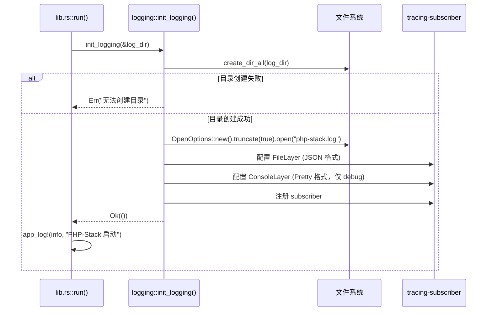
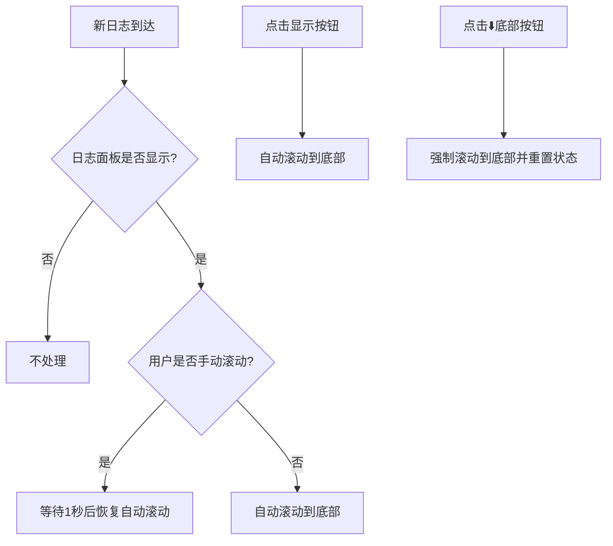
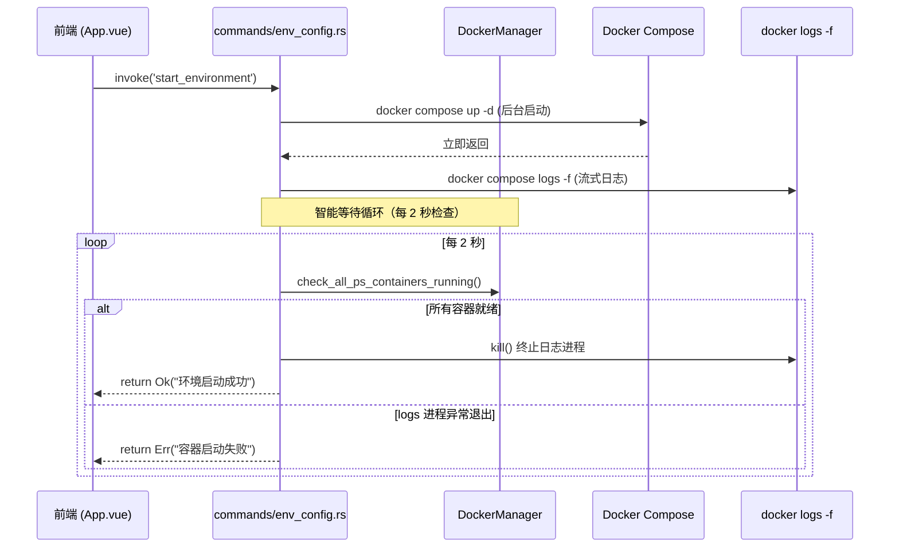

# PHP-Stack 日志与启动系统

> **版本**: v0.2.0 (2026-04-27)  
> ↩ [返回主架构文档](./ARCHITECTURE.md)

---

## 📋 目录

- [1. 实时日志工作流程](#1-实时日志工作流程)
- [2. 容器启动智能等待机制](#2-容器启动智能等待机制)

---

## 1. 实时日志工作流程

**设计理念**：三层日志架构，兼顾持久化、调试和用户体验。

### 1.1 日志架构概览

| 层级 | 目标 | 用途 | 特性 |
|------|------|------|------|
| **文件日志** | `php-stack.log` | 问题排查、审计 | 持久化、完整记录、每次启动覆盖 |
| **控制台日志** | 终端输出 | 开发调试 | 彩色格式化、实时显示 |
| **UI 日志** | 前端面板 | 用户反馈 | 实时推送、自动滚动、可复制 |

### 1.2 后端日志初始化流程



**关键实现**:
- 使用 `tracing-subscriber` 配置多层日志输出
- 文件日志使用 JSON 格式，便于结构化分析
- 控制台日志使用 Pretty 格式，便于开发调试
- 每次启动覆盖日志文件（`truncate: true`），避免无限增长

### 1.3 日志宏定义

```rust
/// 应用日志宏 — 同时输出到文件和 Tauri 事件
#[macro_export]
macro_rules! app_log {
    ($level:ident, $target:expr, $($arg:tt)*) => {{
        let msg = format!($($arg)*);
        // 1. 输出到 tracing（文件 + 控制台）
        event!(target: $target, level, "{}", msg);
        // 2. 发送到前端 UI（通过 Tauri 事件 "env-log"）
        if let Some(handle) = $crate::get_app_handle() {
            let _ = handle.emit("env-log", &msg);
        }
    }};
}
```

### 1.4 前端日志接收与显示

**日志状态管理**（`useToast.ts`）:
- 使用 `ref<string[]>` 存储日志，最新在下
- 保留最近 50 条，超出时移除最早的
- 通过 `listen('env-log', ...)` 监听后端事件

**自动滚动优化**:



**实现要点**:
- `watch(logs, ...)` 监听日志变化，未手动滚动时自动滚到底部
- `@scroll` 事件标记用户手动滚动状态
- 1 秒后自动恢复（平衡阅读体验和实时性）
- 点击"⬇️ 底部"按钮强制滚动并重置状态

### 1.5 日志导出

**后端命令**: `export_logs()` — 读取 `php-stack.log` 文件内容  
**前端调用**: 使用 `@tauri-apps/plugin-clipboard-manager` 的 `writeText()` 写入剪贴板  
**权限配置**: `capabilities/default.json` 中配置 `clipboard-manager:allow-write-text`

### 1.6 相关文件

| 文件 | 职责 |
|------|------|
| `src-tauri/src/logging.rs` | 日志基础设施（tracing 配置、宏定义） |
| `src-tauri/src/lib.rs` | 日志系统初始化 |
| `src-tauri/src/commands/workspace.rs` | 导出日志命令 |
| `src/composables/useToast.ts` | 前端日志状态管理 |
| `src/App.vue` | 日志面板 UI、事件监听、自动滚动 |
| `src-tauri/capabilities/default.json` | 剪贴板权限配置 |

### 1.7 测试建议

**手动测试场景**:
1. 启动应用 → 检查 `php-stack.log` 是否生成
2. 执行操作 → 观察日志面板实时更新
3. 手动向上滚动 → 等待 1 秒后新日志应自动滚动
4. 切换日志面板显示/隐藏 → 打开时应自动滚到底部
5. 点击"📋 复制" → 粘贴验证完整性
6. 连续操作 50+ 次 → 确认日志数量不超过 50 条

---

## 2. 容器启动智能等待机制

**版本**: v0.1.1 (2026-04-25)  
**问题**: 修复启动后按钮状态卡死问题  
**影响模块**: `commands/env_config.rs`, `docker/manager.rs`

### 2.1 问题背景

**现象**: 用户点击"一键启动"后，容器成功启动，但前端按钮一直显示"启动中..."。

**根本原因**: `docker compose up` 不带 `-d` 以前台模式运行，`child.wait()` 永久阻塞，函数永不返回，前端 `finally` 块永不执行。

### 2.2 解决方案：后台启动 + 日志流分离



### 2.3 双重保险机制

| 保险 | 检测目标 | 触发条件 | 处理方式 |
|------|---------|---------|----------|
| **保险 1** | 容器状态 | 所有 ps- 容器进入 `running` 状态 | `break` → 正常返回 ✅ |
| **保险 2** | logs 进程 | `logs -f` 进程退出 | 非零退出码 → `return Err` ❌；零 → `break` ⚠️ |

### 2.4 容器状态检查

**方法**: `DockerManager::check_all_ps_containers_running()`
- 复用 `list_ps_containers()` 获取 ps- 前缀容器
- 解析 `state` 字段（格式 `"Some(RUNNING)"`）
- 空容器列表返回 `false`（尚未创建）

### 2.5 场景分析

| 场景 | 耗时 | 行为 |
|------|------|------|
| **正常快速启动** | ~4 秒 | `up -d` → 2 次检查 → 全部 running → 返回成功 |
| **首次启动（pull/build）** | 数分钟 | `up -d` → 持续检查 → pull 完成后 running → 返回成功 |
| **启动失败** | ~6 秒 | `up -d` → logs 进程异常退出 → 返回错误 |

### 2.6 关键设计决策

**为什么不设置硬超时？**
- 首次启动需要 pull 镜像，可能需要 5-10 分钟
- Docker 会在出错时自然退出，无需额外超时
- 用户希望看到完整的启动过程
- 极端情况下用户会手动关闭软件

**为什么每 2 秒检查一次？**
- 0.5 秒：Docker API 调用频繁，性能开销大
- 2 秒：平衡响应速度和性能，足够感知容器状态变化
- 5 秒：响应慢，用户体验差

**为什么不等待日志线程结束？**
- `join()` 可能永久阻塞（管道未完全关闭时线程卡在 `read()` 上）
- `child.kill()` 会关闭 stdin/stdout/stderr，子线程读到 EOF 后自动退出
- 不需要显式等待，避免阻塞

### 2.7 相关文件

| 文件 | 修改内容 |
|------|----------|
| `src-tauri/src/docker/manager.rs` | `check_all_ps_containers_running()` 方法 |
| `src-tauri/src/commands/env_config.rs` | 智能等待循环实现 |
| `src/App.vue` | 按钮交互优化 |

### 2.8 测试建议

**手动测试场景**:
1. **快速重启**: 容器已存在，点击"一键重启"，观察按钮状态
2. **首次启动**: 删除所有容器后启动，观察 pull/build 过程
3. **端口冲突**: 故意制造端口冲突，观察错误提示和按钮状态
4. **长时间运行**: 连续启动/停止 10 次，确认无内存泄漏

---

↩ [返回主架构文档](./ARCHITECTURE.md)
