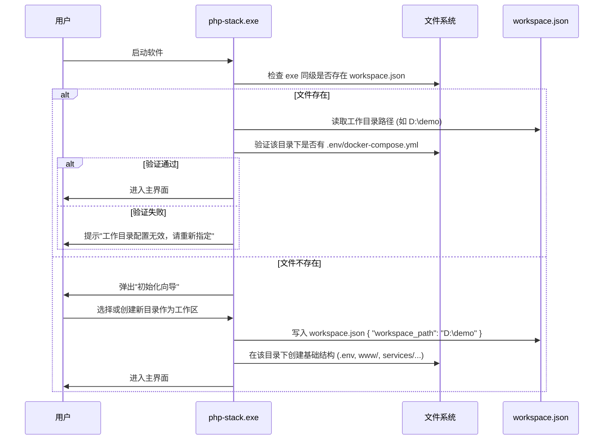
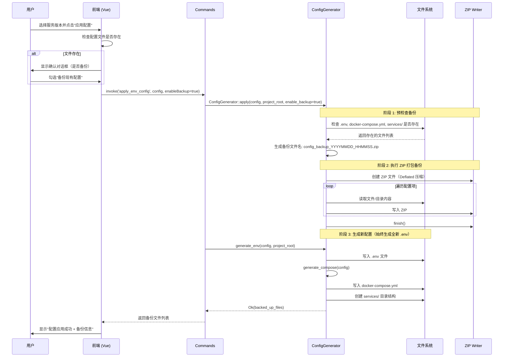
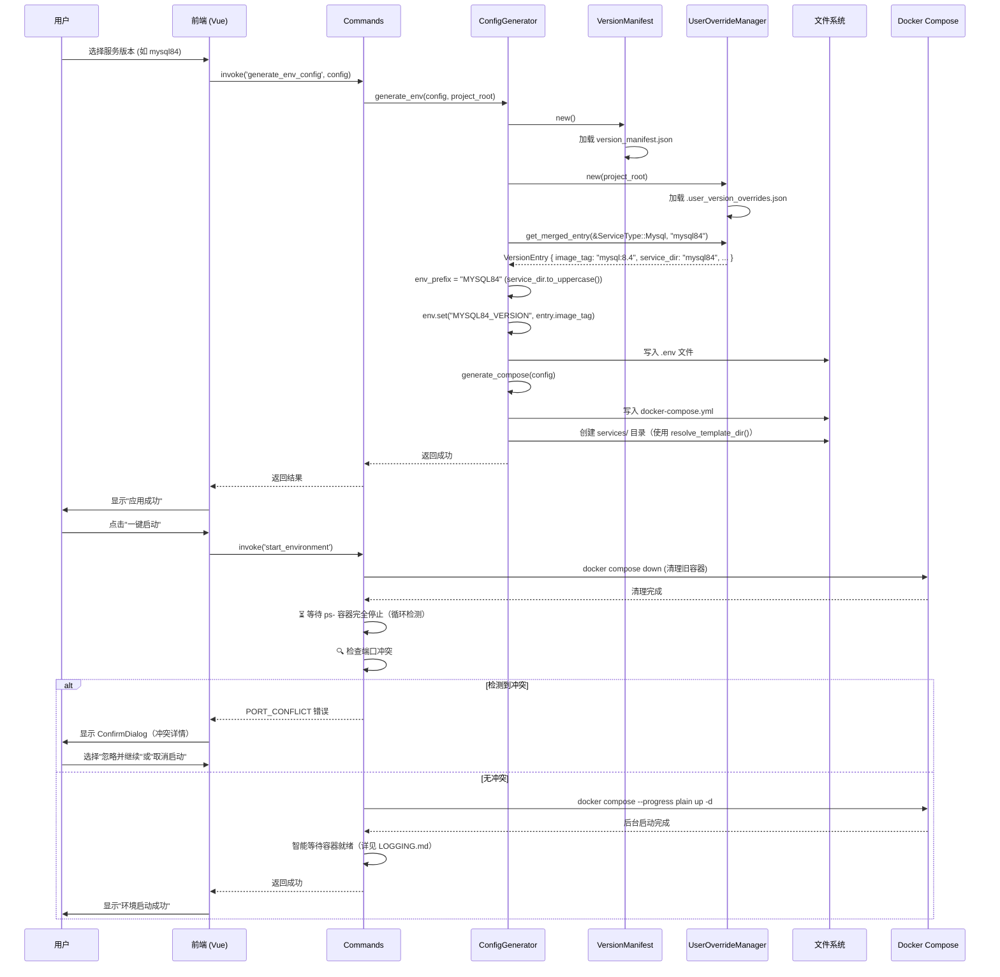
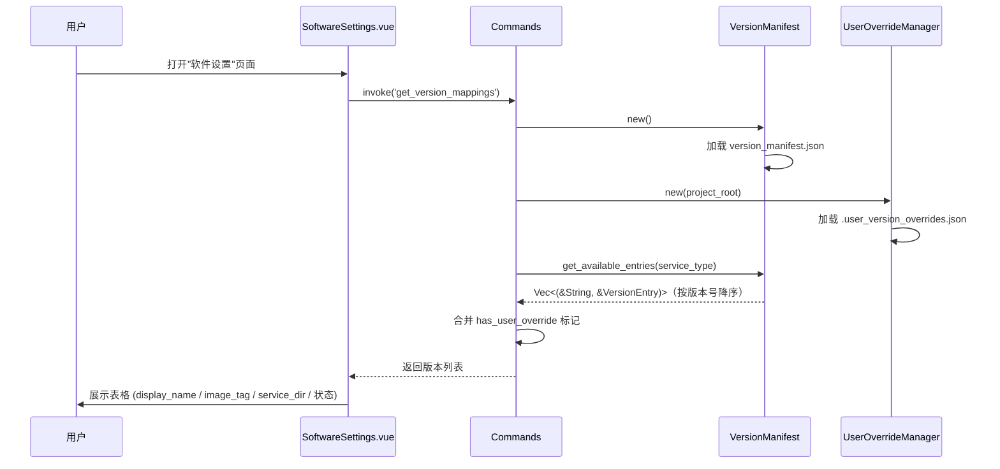
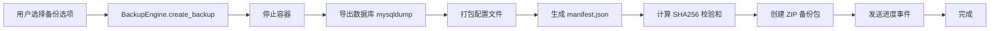
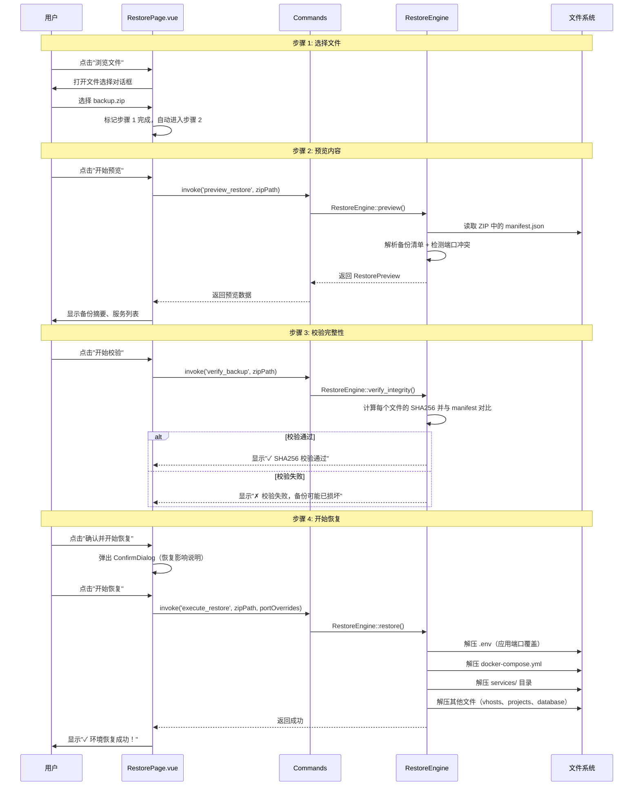

# PHP-Stack 核心工作流程

> **版本**: v0.2.0 (2026-04-27)  
> ↩ [返回主架构文档](./ARCHITECTURE.md)

---

## 📋 目录

- [3.0 工作目录初始化流程](#30-工作目录初始化流程)
- [3.1 环境配置与启动流程](#31-环境配置与启动流程)
- [3.2 版本映射查询流程](#32-版本映射查询流程)
- [3.3 备份流程](#33-备份流程)
- [3.4 环境恢复流程](#34-环境恢复流程)

---

## 3.0 工作目录初始化流程

**设计理念**：解耦软件本体与业务数据，实现跨平台无缝迁移。



**配置文件格式 (`workspace.json`)**:
```json
{
  "workspace_path": "D:\\demo",
  "last_updated": "2026-04-21T10:00:00Z"
}
```

**备份与恢复逻辑**:
- **备份**: 仅打包 `workspace.json` 中指定的目录内容。位于该目录之外的文件不予备份，并在 UI 层给予明确提示。
- **恢复**: 在新环境中，用户先指定一个新的工作目录路径，软件将 ZIP 包内的所有内容解压至该路径，并自动更新本地的 `workspace.json`。

---

## 3.1 环境配置与启动流程

### 3.1.1 配置应用与备份机制

**设计理念**：采用 ZIP 打包方式备份配置文件，确保数据安全且易于管理。



**备份文件格式**：
- **命名规则**: `config_backup_YYYYMMDD_HHMMSS.zip`
- **包含内容**: `.env`、`docker-compose.yml`、`services/`、`.user_mirror_config.json`、`.user_version_overrides.json`

**v0.2.0 变更**：
- `apply()` 始终生成全新 `.env`，不再读取现有 `.env` 进行合并
- `generate_env()` 接受 `project_root` 参数，不再使用内部 `get_project_root()`

### 3.1.2 完整启动流程



**v0.2.0 关键变更**：
- `ServiceEntry.version` 语义变更为 manifest ID（如 `"mysql84"`），不再是版本号
- 配置生成器直接使用 `entry.image_tag`，不再需要 `format!("{}:{}", image, tag)` 拼接
- 目录名直接使用 `entry.service_dir`，不再需要 `version.replace('.', "")` 计算
- 模板选择使用 `resolve_template_dir()` 辅助函数，消除 `if version.starts_with(...)` 硬编码链
- `UserOverrideManager` 已完全集成到配置生成流程

### 3.1.3 端口冲突检测机制

**检测时机**: `start_environment` 命令中，清理旧容器后、启动新容器前。

**流程**:
```
清理旧容器 → 等待 ps- 容器停止（循环检测，最多 10 次） → 检查端口冲突 → 启动新容器
```

**容器停止等待机制**:
- 循环调用 `list_ps_containers()` 检查 ps- 前缀容器状态
- 最多等待 10 次，每次间隔 1 秒
- 所有 ps- 容器停止后立即继续
- 超时时显示未停止的容器列表

**端口冲突检测**:
- 使用 `list_all_running_containers()` 获取所有运行中容器（包括外部容器）
- 遍历配置端口，检查是否被其他容器占用
- 返回格式: `PORT_CONFLICT:端口 X (服务A) 被容器 Y 占用`

**前端处理**:
- 检测 `errorMsg.startsWith('PORT_CONFLICT:')`
- 使用 ConfirmDialog 显示冲突详情
- 用户可选择"忽略并继续"或"取消启动"

---

## 3.2 版本映射查询流程



**返回数据结构（v0.2.0）**:
```json
{
  "php": [
    {
      "id": "php85",
      "display_name": "PHP 8.5",
      "image_tag": "php:8.5-fpm",
      "service_dir": "php85",
      "default_port": 9000,
      "show_port": false,
      "eol": false,
      "description": "PHP 8.5 (最新开发版)",
      "has_user_override": false
    }
  ]
}
```

**前端下拉列表**:
- `value` = `v.id`（如 `"php82"`）
- 显示文本 = `v.display_name → v.image_tag`（如 `"PHP 8.2 → php:8.2-fpm"`）
- 端口输入框根据 `v.show_port` 控制显示（PHP 不显示端口配置）

**用户 Override 操作**:
- `save_user_override(service_type, id, image_tag)` — 参数使用 manifest ID 和完整镜像名
- `remove_user_override(service_type, id)` — 参数使用 manifest ID

---

## 3.3 备份流程



**备份包内容**:
- `manifest.json` — 备份元数据（版本、时间戳、服务列表、文件校验和）
- `.env` — 环境变量配置
- `docker-compose.yml` — Compose 配置
- `services/` — 服务配置目录
- `.user_mirror_config.json` — 用户镜像源配置（如存在）
- `.user_version_overrides.json` — 用户版本覆盖配置（如存在）
- `database/` — 数据库导出（可选）
- `projects/` — 项目文件（可选，glob 模式匹配）

---

## 3.4 环境恢复流程

**设计理念**：采用向导式分步卡片布局，用户主动控制节奏，避免信息过载。



**关键设计决策**:

| 设计点 | 说明 |
|--------|------|
| **分步卡片** | 一次只显示当前步骤，减少信息过载 |
| **手动控制** | 不自动跳转，用户主动决定是否继续 |
| **职责分离** | 恢复 = 文件解压；启动 = 镜像拉取 + 容器运行 |
| **端口冲突** | 预览时检测，自动推荐可用端口，用户可修改 |
| **完整性校验** | SHA256 逐文件验证，校验通过才能进入下一步 |

**相关文件**:
- 前端: `src/components/RestorePage.vue`
- 后端: `src-tauri/src/engine/restore_engine.rs`
- 类型: `src/types/env-config.ts`

---

↩ [返回主架构文档](./ARCHITECTURE.md)
