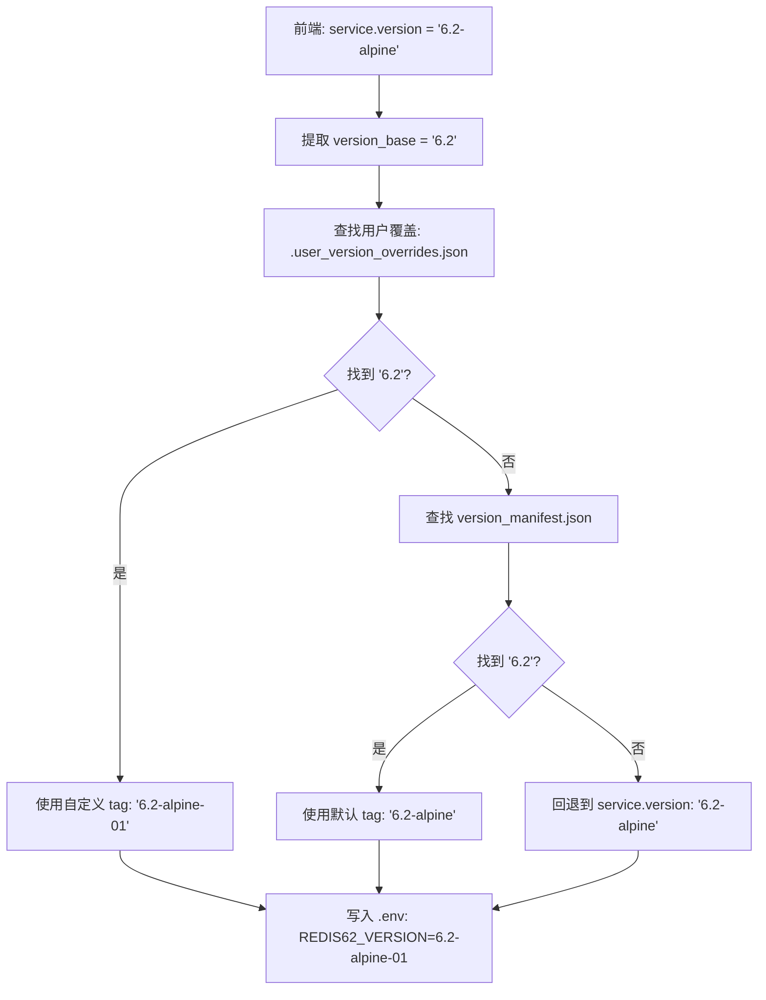

# Redis/Nginx 版本键匹配问题修复

## 📋 问题描述

### 现象

用户在 `.user_version_overrides.json` 中配置了 Redis 6.2 的自定义标签：

```json
{
  "redis": {
    "6.2": {
      "tag": "6.2-alpine-01",
      "description": "Redis 6.2 (旧版本)"
    }
  }
}
```

但生成的 `.env` 文件中仍然使用默认标签：

```env
REDIS62_VERSION=6.2-alpine  # ❌ 应该是 6.2-alpine-01
```

### 根本原因

**版本键不匹配**导致用户覆盖配置无法生效。

#### 数据流分析

1. **前端传递**: `service.version = "6.2-alpine"` （包含 tag）
2. **配置文件键**: `"6.2"` （纯版本号）
3. **查找逻辑**: 
   ```rust
   // ❌ 错误：用 "6.2-alpine" 查找 "6.2"，无法匹配
   override_manager.get_merged_image_info(&VmServiceType::Redis, &service.version)
   ```

#### 为什么之前没发现？

- MySQL 的版本号是纯版本号（如 `"8.4"`），所以能正确匹配
- Redis 和 Nginx 的版本号包含 tag（如 `"6.2-alpine"`），导致匹配失败

---

## ✅ 修复方案

### 核心思路

在查找用户覆盖配置时，**先提取纯版本号**，再进行匹配。

### 修改内容

#### 1. Redis 配置生成

**文件**: `src-tauri/src/engine/config_generator.rs`

**修改前**:
```rust
ServiceType::Redis => {
    let version_base = service.version.split('-').next().unwrap_or(&service.version);
    // ... 计算 ver ...
    
    // ❌ 错误：使用 "6.2-alpine" 查找
    let image_tag = override_manager
        .get_merged_image_info(&VmServiceType::Redis, &service.version)
        // ...
}
```

**修改后**:
```rust
ServiceType::Redis => {
    let version_base = service.version.split('-').next().unwrap_or(&service.version);
    // ... 计算 ver ...
    
    // ✅ 正确：使用 "6.2" 查找
    let image_tag = override_manager
        .get_merged_image_info(&VmServiceType::Redis, version_base)  // ← 改用 version_base
        .map(|info| info.tag.clone())
        .unwrap_or_else(|| {
            manifest
                .get_image_info(&VmServiceType::Redis, version_base)  // ← 改用 version_base
                .map(|info| info.tag.clone())
                .unwrap_or(service.version.clone())
        });
}
```

#### 2. Nginx 配置生成

同样的修复应用到 Nginx：

```rust
ServiceType::Nginx => {
    let version_base = service.version.split('-').next().unwrap_or(&service.version);
    // ...
    
    // ✅ 使用 version_base 查找
    let image_tag = override_manager
        .get_merged_image_info(&VmServiceType::Nginx, version_base)
        // ...
}
```

#### 3. MySQL 无需修改

MySQL 的版本号已经是纯版本号格式（如 `"8.4"`），不需要提取：

```rust
ServiceType::MySQL => {
    // service.version = "8.4" （已经是纯版本号）
    let image_tag = override_manager
        .get_merged_image_info(&VmServiceType::Mysql, &service.version)  // ✅ 直接使用
        // ...
}
```

---

## 🧪 测试验证

### 单元测试

```bash
cargo test --lib config_generator

# 结果: ✅ test result: ok. 7 passed
```

### 功能测试步骤

#### 步骤 1: 准备用户覆盖配置

确保 `.user_version_overrides.json` 存在：

```json
{
  "redis": {
    "6.2": {
      "tag": "6.2-alpine-01",
      "description": "Redis 6.2 (旧版本)"
    }
  }
}
```

**注意**: 键必须是纯版本号 `"6.2"`，不能是 `"6.2-alpine"`。

#### 步骤 2: 应用配置

1. 打开"环境配置"页面
2. 选择 Redis 6.2
3. 点击"应用配置"

#### 步骤 3: 检查 .env 文件

```powershell
Get-Content .env | Select-String "REDIS62_VERSION"
```

**预期输出**:
```env
REDIS62_VERSION=6.2-alpine-01  # ✅ 使用自定义标签
```

#### 步骤 4: 启动容器验证

```bash
docker compose up -d redis62
docker ps | findstr redis62
```

**预期**:
```
IMAGE: redis:6.2-alpine-01
```

---

## 📊 版本键格式对照表

| 服务 | 前端传递 (service.version) | 配置文件键 | 提取方法 | 状态 |
|------|---------------------------|-----------|---------|------|
| **PHP** | `"8.4"` | `"8.4"` | 无需提取 | ✅ |
| **MySQL** | `"8.4"` | `"8.4"` | 无需提取 | ✅ |
| **Redis** | `"6.2-alpine"` | `"6.2"` | `split('-')[0]` | ✅ 已修复 |
| **Nginx** | `"1.27-alpine"` | `"1.27"` | `split('-')[0]` | ✅ 已修复 |

---

## 🔍 技术细节

### 版本提取逻辑

```rust
// 从 "6.2-alpine" 提取 "6.2"
let version_base = service.version.split('-').next().unwrap_or(&service.version);

// 示例：
// "6.2-alpine" → "6.2"
// "1.27-alpine" → "1.27"
// "8.4" → "8.4" (无 '-' 时返回原值)
```

### 配置合并流程



### 为什么需要这样设计？

1. **用户友好**: 配置文件使用简洁的纯版本号（`"6.2"`）
2. **灵活性**: 用户可以自定义任何 tag（`"6.2-alpine-01"`, `"6.2-custom"` 等）
3. **兼容性**: 支持多种版本格式（`"6.2"`, `"6.2-alpine"`, `"6.2.5"` 等）

---

## ⚠️ 注意事项

### 1. 配置文件格式

`.user_version_overrides.json` 中的键**必须**是纯版本号：

```json
{
  "redis": {
    "6.2": { ... },    // ✅ 正确
    "6.2-alpine": { ... }  // ❌ 错误：无法匹配
  }
}
```

### 2. 前端数据格式

前端传递的 `service.version` 可能包含 tag：

```typescript
// 可能的值
service.version = "6.2-alpine"  // Redis/Nginx
service.version = "8.4"         // PHP/MySQL
```

后端需要统一处理，提取纯版本号进行匹配。

### 3. 重新应用配置

修改用户覆盖配置后，**必须**重新点击"应用配置"：

```
编辑配置 → 保存 → 应用配置 → 生成 .env → 重启容器
```

---

## 📝 提交记录

```
commit 3538807 - fix: 修正Redis和Nginx版本键匹配问题，使用纯版本号查找用户覆盖
  - Redis: 使用 version_base 而非 service.version
  - Nginx: 使用 version_base 而非 service.version
  - MySQL: 无需修改（已是纯版本号）
  - 添加注释说明版本提取逻辑
  - 单元测试通过 (7/7)
```

---

## 🚀 后续优化建议

### 短期
1. ✅ ~~修复版本键匹配问题~~
2. ⏳ 添加集成测试验证端到端流程
3. ⏳ 在前端添加版本格式提示

### 中期
1. 🔧 统一版本格式处理逻辑（提取为公共函数）
2. 📝 在 UI 中显示版本键格式要求
3. 🧪 增加边界情况测试（空版本、特殊字符等）

### 长期
1. 🚀 支持版本别名（如 `"latest"` → `"8.4"`）
2. 📊 添加版本兼容性检查
3. 🔍 提供版本冲突检测工具

---

## 📚 相关文档

- [USER_OVERRIDE_GUIDE.md](./USER_OVERRIDE_GUIDE.md) - 用户版本覆盖功能使用指南
- [VERIFY_USER_OVERRIDE.md](./VERIFY_USER_OVERRIDE.md) - 配置验证指南
- [FIX_USER_OVERRIDE_NOT_APPLIED.md](./FIX_USER_OVERRIDE_NOT_APPLIED.md) - 之前的修复报告

---

**修复时间**: 2026-04-20  
**修复人**: AI Assistant  
**状态**: ✅ 已完成并测试通过
