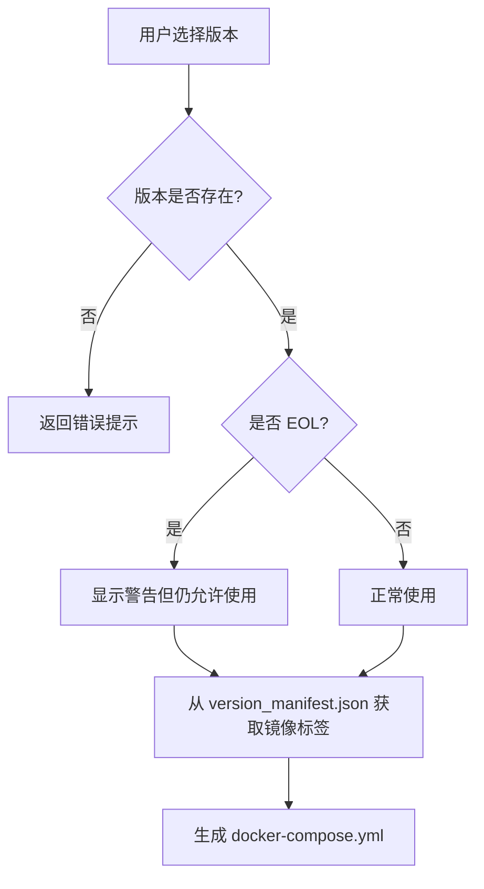

# 版本清单管理系统 (Version Manifest)

## 📋 概述

版本清单系统用于管理所有服务（PHP、MySQL、Redis、Nginx）的版本与 Docker 镜像标签的映射关系。

## 🎯 解决的问题

1. **版本与标签解耦**：用户选择 `8.4`，实际使用 `mysql:8.4-lts`
2. **集中维护**：所有版本信息在一个 JSON 文件中管理
3. **EOL 检测**：自动识别已停止维护的版本并给出警告
4. **版本验证**：防止选择不存在的版本

## 📁 文件结构

```
src-tauri/
├── services/
│   └── version_manifest.json    # 版本清单数据文件
└── src/
    └── engine/
        └── version_manifest.rs  # Rust 实现模块
```

## 🔧 使用方法

### 1. 基础用法

```rust
use crate::engine::version_manifest::{VersionManifest, ServiceType};

// 创建版本清单管理器
let manifest = VersionManifest::new();

// 获取 MySQL 8.4 的镜像信息
if let Some(info) = manifest.get_image_info(&ServiceType::Mysql, "8.4") {
    println!("镜像: {}", info.full_name());  // mysql:8.4-lts
    println!("描述: {}", info.description.as_ref().unwrap());
}
```

### 2. 在配置生成器中使用

```rust
// 修改前
env.set("MYSQL_VERSION", &service.version);  // "8.4"

// 修改后
let manifest = VersionManifest::new();
if let Some(image_name) = manifest.get_full_image_name(&ServiceType::Mysql, &service.version) {
    env.set("MYSQL_IMAGE", &image_name);  // "mysql:8.4-lts"
} else {
    return Err(format!("不支持的 MySQL 版本: {}", service.version));
}
```

### 3. 版本验证

```rust
let manifest = VersionManifest::new();

// 检查版本是否存在
if !manifest.is_version_valid(&ServiceType::Mysql, "8.4") {
    return Err("MySQL 8.4 不存在".to_string());
}

// 获取 EOL 警告
if let Some(warning) = manifest.get_version_warning(&ServiceType::Mysql, "5.7") {
    println!("{}", warning);  // ⚠️ MySQL 5.7 (已停止维护) - 建议使用更新版本
}
```

### 4. 获取推荐版本

```rust
let manifest = VersionManifest::new();

// 获取 MySQL 的推荐版本（最新的非 EOL 版本）
if let Some(recommended) = manifest.get_recommended_version(&ServiceType::Mysql) {
    println!("推荐使用 MySQL {}", recommended);  // 8.4
}
```

## 📝 更新版本清单

### 添加新版本

编辑 `services/version_manifest.json`：

```json
{
  "mysql": {
    "8.4": {
      "image": "mysql",
      "tag": "8.4-lts",
      "eol": false,
      "description": "MySQL 8.4 LTS (最新长期支持版)"
    },
    "9.0": {
      "image": "mysql",
      "tag": "9.0-innovation",
      "eol": false,
      "description": "MySQL 9.0 Innovation (创新版)"
    }
  }
}
```

### 标记 EOL 版本

```json
{
  "php": {
    "7.4": {
      "image": "php",
      "tag": "7.4-fpm",
      "base_image": "debian",
      "eol": true,  // ← 设置为 true
      "description": "PHP 7.4 (已停止维护)"
    }
  }
}
```

## 🔄 工作流程



## 💡 最佳实践

1. **定期更新**：每当有新版本发布时，及时更新 `version_manifest.json`
2. **测试标签**：添加新版本前，先在 Docker Hub 上验证标签是否存在
3. **保持向后兼容**：不要删除旧版本，只标记为 EOL
4. **提供描述**：为每个版本添加清晰的描述，帮助用户理解

## 🚀 未来扩展

- [ ] 自动从 Docker Hub API 同步最新版本
- [ ] 支持自定义镜像源（如阿里云、清华镜像）
- [ ] 版本依赖关系检查（如 PHP 8.4 需要 MySQL 8.0+）
- [ ] 前端 UI 显示 EOL 警告和推荐版本
