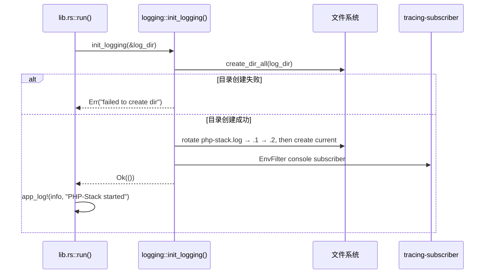
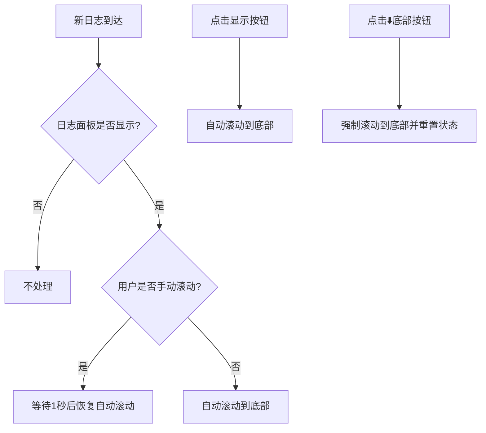
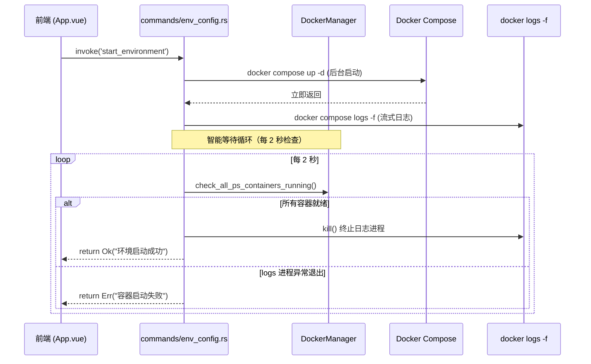

# PHP-Stack 日志与启动系统

> **版本**: v0.3.1  
> ↩ [返回主架构文档](./ARCHITECTURE.md)

---

## 📋 目录

- [1. 实时日志工作流程](#1-实时日志工作流程)
- [2. 容器启动智能等待机制](#2-容器启动智能等待机制)

---

## 1. 实时日志工作流程

**设计理念**：三层日志架构，兼顾持久化、调试和用户体验。

### 1.1 日志架构概览

| 层级 | 目标 | 用途 | 特性 |
|------|------|------|------|
| **文件日志** | `php-stack.log` | 问题排查、审计 | 持久化、启动时轮转保留 2 代、写入全部等级 |
| **控制台日志** | 终端输出 | 开发调试 | tracing + EnvFilter |
| **UI 日志** | 前端面板 | 用户反馈 | `env-log` 推送 `{ level, message }`、按等级过滤着色 |

### 1.2 后端日志初始化流程

**关键实现**:
- 文件由 `write_to_log_file` 写入，格式 `[HH:MM:SS.mmm] LEVEL [module] message`
- 启动时轮转：当前 → `.1` → `.2`，超出丢弃
- 控制台使用 `tracing_subscriber` + `EnvFilter`（可用 `RUST_LOG` 覆盖）
- 用户可见文案统一为英文短句，无 emoji

### 1.3 日志宏定义

- `app_log!(level, module, ...)`：写文件 + 控制台，不推 UI
- `ui_log!(app, level, module, ...)`：先 `app_log!`，再 emit `env-log`，payload 为 `{ "level": "info|warn|error", "message": "..." }`；空消息丢弃

### 1.4 前端日志接收与显示

**日志状态管理**（`useToast.ts`）:
- `LogEntry { time, level, message }`，最多 200 条
- 关于页配置最低显示等级（`php-stack-log-level`），只过滤面板，不删缓冲、不改文件
- `listen('env-log')` 兼容旧版纯字符串 payload（当作 info）
- 前端操作日志走 `addLogKey`，始终使用英文 locale

**自动滚动优化**:

**实现要点**:
- `watch(logs, ...)` 监听日志变化，未手动滚动时自动滚到底部
- `@scroll` 事件标记用户手动滚动状态
- 1 秒后自动恢复（平衡阅读体验和实时性）
- 点击"⬇️ 底部"按钮强制滚动并重置状态

### 1.5 日志导出

**后端命令**: `export_logs_to(dest)` 复制完整 `php-stack.log`；`export_logs()` 读文件返回文本  
**入口**: 日志面板「导出」、关于页「导出日志」  
**复制**: 面板「复制」只复制当前可见的最近条目

### 1.6 相关文件

| 文件 | 职责 |
|------|------|
| `src-tauri/src/macros.rs` | `app_log!` / `ui_log!` |
| `src-tauri/src/logging.rs` | 轮转、写文件、`UiLogPayload` |
| `src-tauri/src/lib.rs` | 日志系统初始化 |
| `src-tauri/src/commands/workspace.rs` | 导出日志命令 |
| `src/composables/useToast.ts` | 前端日志状态、等级过滤 |
| `src/components/AboutPage.vue` | 日志等级设置、导出 |
| `src/App.vue` | 日志面板 UI、事件监听、自动滚动 |

### 1.7 测试建议

**手动测试场景**:
1. 启动应用 → 检查 `php-stack.log` 是否生成且为英文分隔线
2. 执行操作 → 观察日志面板实时更新，失败行为 error 着色
3. 关于页把等级调到 warn → info 行隐藏，导出文件仍含 info
4. 手动向上滚动 → 等待 1 秒后新日志应自动滚动
5. 连续操作 200+ 次 → 确认面板不超过 200 条

---

## 2. 容器启动智能等待机制

**版本**: v0.1.1 (2026-04-25)  
**问题**: 修复启动后按钮状态卡死问题  
**影响模块**: `commands/env_config.rs`, `docker/manager.rs`

### 2.1 问题背景

**现象**: 用户点击"一键启动"后，容器成功启动，但前端按钮一直显示"启动中..."。

**根本原因**: `docker compose up` 不带 `-d` 以前台模式运行，`child.wait()` 永久阻塞，函数永不返回，前端 `finally` 块永不执行。

### 2.2 解决方案：后台启动 + 日志流分离

### 2.3 双重保险机制

| 保险 | 检测目标 | 触发条件 | 处理方式 |
|------|---------|---------|----------|
| **保险 1** | 容器状态 | 所有 ps- 容器进入 `running` 状态 | `break` → 正常返回 ✅ |
| **保险 2** | logs 进程 | `logs -f` 进程退出 | 非零退出码 → `return Err` ❌；零 → `break` ⚠️ |

### 2.4 容器状态检查

**方法**: `DockerManager::check_all_ps_containers_running()`
- 复用 `list_ps_containers()` 获取 ps- 前缀容器
- 解析 `state` 字段（格式 `"Some(RUNNING)"`）
- 空容器列表返回 `false`（尚未创建）

### 2.5 场景分析

| 场景 | 耗时 | 行为 |
|------|------|------|
| **正常快速启动** | ~4 秒 | `up -d` → 2 次检查 → 全部 running → 返回成功 |
| **首次启动（pull/build）** | 数分钟 | `up -d` → 持续检查 → pull 完成后 running → 返回成功 |
| **启动失败** | ~6 秒 | `up -d` → logs 进程异常退出 → 返回错误 |

### 2.6 关键设计决策

**为什么不设置硬超时？**
- 首次启动需要 pull 镜像，可能需要 5-10 分钟
- Docker 会在出错时自然退出，无需额外超时
- 用户希望看到完整的启动过程
- 极端情况下用户会手动关闭软件

**为什么每 2 秒检查一次？**
- 0.5 秒：Docker API 调用频繁，性能开销大
- 2 秒：平衡响应速度和性能，足够感知容器状态变化
- 5 秒：响应慢，用户体验差

**为什么不等待日志线程结束？**
- `join()` 可能永久阻塞（管道未完全关闭时线程卡在 `read()` 上）
- `child.kill()` 会关闭 stdin/stdout/stderr，子线程读到 EOF 后自动退出
- 不需要显式等待，避免阻塞

### 2.7 相关文件

| 文件 | 修改内容 |
|------|----------|
| `src-tauri/src/docker/manager.rs` | `check_all_ps_containers_running()` 方法 |
| `src-tauri/src/commands/env_config.rs` | 智能等待循环实现 |
| `src/App.vue` | 按钮交互优化 |

### 2.8 测试建议

**手动测试场景**:
1. **快速重启**: 容器已存在，点击"一键重启"，观察按钮状态
2. **首次启动**: 删除所有容器后启动，观察 pull/build 过程
3. **端口冲突**: 故意制造端口冲突，观察错误提示和按钮状态
4. **长时间运行**: 连续启动/停止 10 次，确认无内存泄漏

---

↩ [返回主架构文档](./ARCHITECTURE.md)
